# Architecture

This document provides a comprehensive overview of Kokibot's system architecture, including core components, data flow, subsystems, and design patterns.

## Table of Contents
- [System Overview](#system-overview)
- [Multi-Agent Architecture](#multi-agent-architecture)
- [Core Components](#core-components)
- [Subsystems](#subsystems)
- [Data Flow](#data-flow)
- [Design Patterns](#design-patterns)
- [Technology Stack](#technology-stack)
- [Extension Points](#extension-points)

---

## System Overview

Kokibot is built on a **pluggable, multi-agent architecture** that enables:

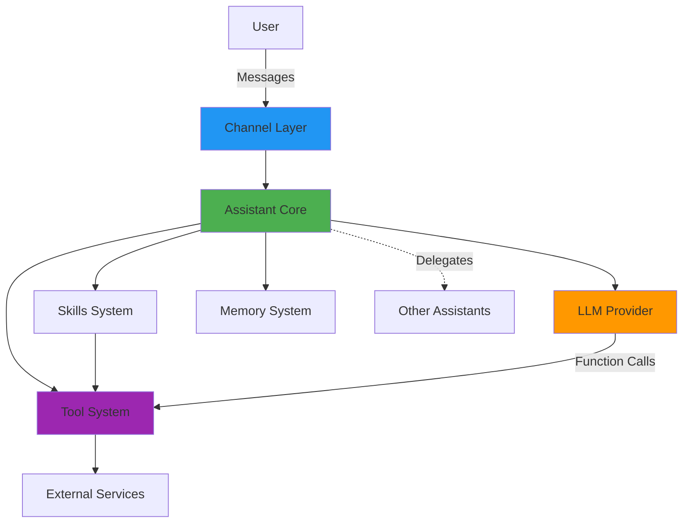

### Key Architectural Principles

1. **Multi-Agent System** - Multiple specialized assistants working together
2. **Modularity** - Components are loosely coupled and independently testable
3. **Extensibility** - New tools, skills, channels, and LLM providers can be added without modifying core code
4. **Iterative Reasoning** - Multi-step reasoning loop with parallel tool execution
5. **Configuration-Driven** - All behavior controlled through JSON configuration files
6. **Multi-Tier Memory** - SessionLog, DailyLog, ChatHistory, and long-term Memory

---

## Multi-Agent Architecture

Kokibot supports running multiple specialized assistants simultaneously in a coordinator-specialist pattern.

### Architecture Overview

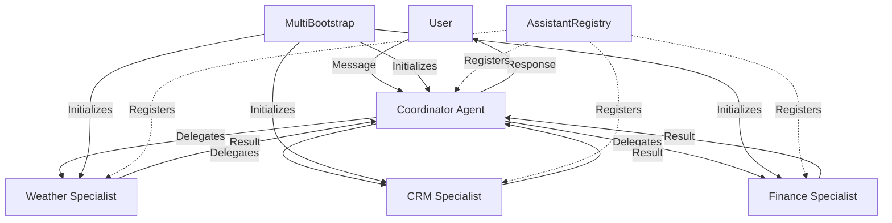

### Key Components

**MultiBootstrap** (`MultiBootstrap.kt`)
- Main Spring Boot service that initializes the system
- Discovers agents from `~/kokibot/agents/` directory
- Each subdirectory becomes a separate assistant with isolated workspace
- Creates a `Bootstrap` instance for each agent
- All agents share the same `AssistantRegistry` for cross-agent communication

**AssistantRegistry** (`AssistantRegistry.kt`)
- Central registry for all assistant instances
- `register(assistant)` - Adds agent to registry
- `get(name)` - Retrieves agent by name (case-insensitive)
- `all()` - Returns list of all registered agents
- Thread-safe for concurrent access

**SwarmDelegateTool** (`tools/swarm/SwarmDelegateTool.kt`)
- Enables task delegation between agents
- Parameters: `name` (specialist agent name), `task` (task description), `context` (optional)
- Returns results prefixed with agent name
- Used by coordinator agents to delegate work

**DelegationStack** (`service/swarm/DelegationStack.kt`)
- Tracks delegation chains to prevent stack overflow
- Max depth validation (default: 5)
- Cycle detection (A→B→C→A)
- Session-isolated tracking

### Directory Structure

```
~/kokibot/agents/
├── coordinator/                    # Coordinator agent
│   ├── config/settings.json        # coordinator: true
│   ├── ASSISTANT.md                # System instructions
│   ├── COORDINATOR.md              # Coordinator-specific instructions (auto-loaded)
│   ├── workspace/
│   └── skills/
├── weather-specialist/             # Weather specialist
│   ├── config/settings.json
│   ├── ASSISTANT.md
│   ├── workspace/
│   └── skills/weather/
└── crm-specialist/                 # CRM specialist
    ├── config/settings.json
    ├── ASSISTANT.md
    ├── workspace/
    └── skills/crm/
```

### Delegation Flow

1. User sends message to coordinator via channel
2. Coordinator analyzes task and breaks into subtasks
3. Coordinator calls `swarm_delegate(name="weather-specialist", task="...")`
4. DelegationStack validates depth and cycle constraints
5. SwarmDelegateTool retrieves specialist from AssistantRegistry
6. Specialist processes task with its own tools and skills
7. Result returned to coordinator with `Result from {name}:` prefix
8. Coordinator synthesizes final response to user

---

## Core Components

### 1. MultiBootstrap (`MultiBootstrap.kt`)

**Responsibility:** Application entry point and multi-agent initialization

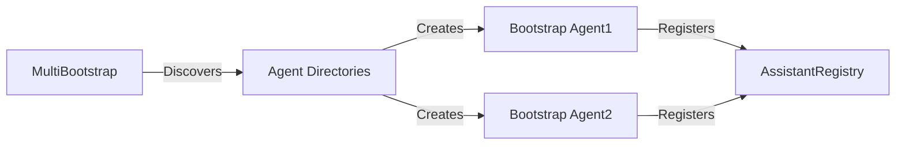

**Key Functions:**
- Discovers all agent directories from `~/kokibot/agents/`
- Creates separate `Bootstrap` instance for each agent
- Determines home directory based on Spring profile (dev: `~/kokibot`, prod: `~/.kokibot`)
- Manages lifecycle with `@PostConstruct` and `@PreDestroy`
- Logs warning if `agents/` directory doesn't exist

**Configuration:**
- **Development mode** (default): `~/kokibot/`
- **Production mode** (`prod` profile): `~/.kokibot/`

---

### 2. Bootstrap (`Bootstrap.kt`)

**Responsibility:** Single agent initialization and lifecycle

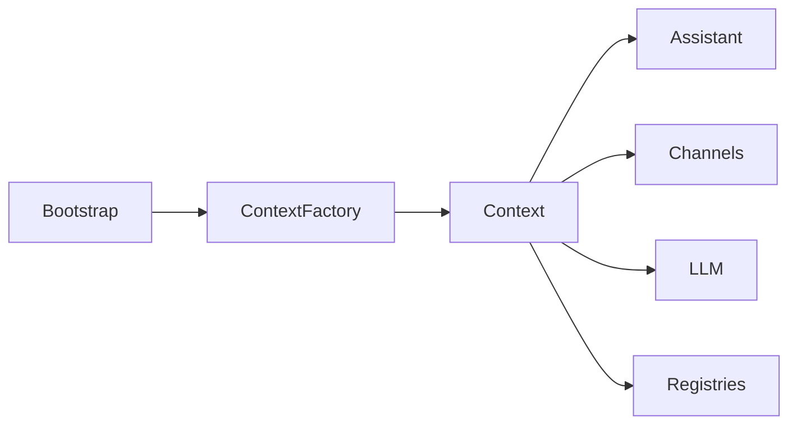

**Key Functions:**
- Loads configuration from agent's `config/settings.json`
- Creates `Context` via `ContextFactory`
- Initializes assistant, channels, tools, skills, memory
- Manages lifecycle (init/destroy)

**Configuration File:** `~/kokibot/agents/{agent-name}/config/settings.json`

---

### 3. Context (`Context.kt`)

**Responsibility:** Central dependency injection container and state management

The Context object contains all resources needed by an assistant:

| Component | Type | Purpose |
|-----------|------|---------|
| `home` | File | Agent's home directory |
| `assistant` | Assistant | Main reasoning engine |
| `llm` | LLM | Language model provider |
| `toolRegistry` | ToolRegistry | Registry of available tools |
| `skillRegistry` | SkillRegistry | Registry of discovered skills |
| `commandRegistry` | CommandRegistry | Registry of system commands |
| `channelRegistry` | ChannelRegistry | Registry of communication channels |
| `marketplaceRegistry` | MarketplaceRegistry | Registry of skill marketplaces |
| `assistantRegistry` | AssistantRegistry | Registry of all assistants (shared) |
| `memory` | Memory | Long-term memory compaction |
| `dailyLog` | DailyLog | Daily activity journal |
| `sessionLog` | SessionLog | Detailed execution trace |
| `chatHistory` | ChatHistory | Conversation storage |
| `fileService` | FileService | File operations service |
| `heartbeat` | Heartbeat | Periodic task scheduler |
| `delegationStack` | DelegationStack | Multi-agent delegation tracking |
| `config` | Map | Configuration settings |
| `jsonMapper` | JsonMapper | JSON serialization |

**Lifecycle:**
- `init(config)` - Initializes all subsystems in order
- `destroy()` - Cleanup all resources
- `health()` - Returns health status of all components
- `resources()` - Returns list of all managed resources

**Initialization Order:**
1. Assistant
2. Channels
3. Marketplaces (before skills, as skills may come from marketplaces)
4. Skills
5. Tools
6. LLM
7. Memory (Memory, DailyLog, SessionLog, ChatHistory)
8. Commands
9. FileService
10. Heartbeat
11. DelegationStack

---

### 4. Assistant (`Assistant.kt`)

**Responsibility:** Main reasoning loop and orchestration engine

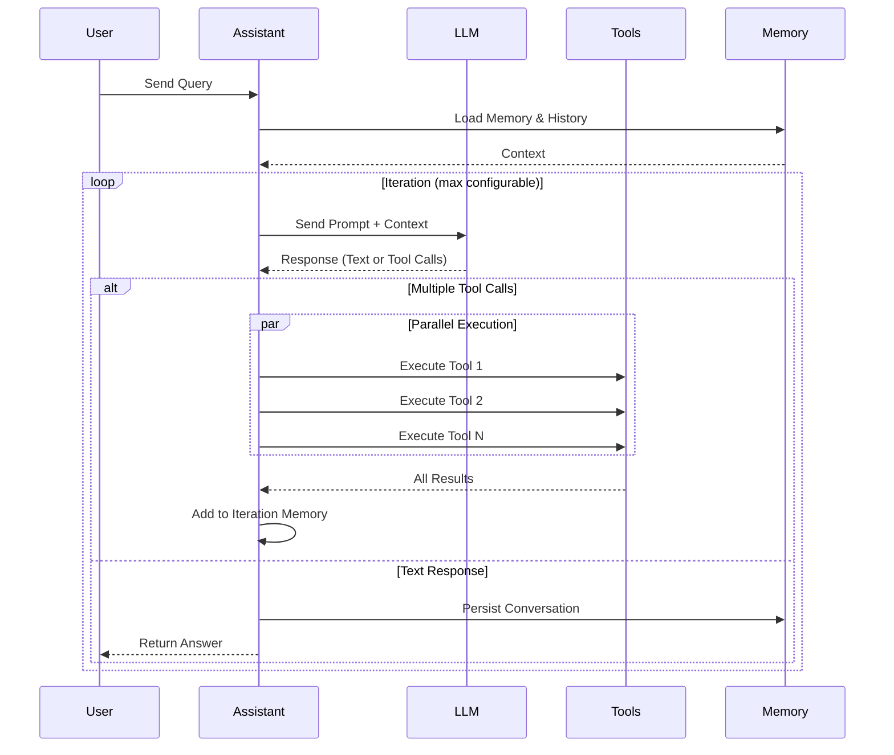

**Key Features:**
- **Iterative Reasoning Loop** - Max iterations configurable (default: 10)
- **Parallel Tool Execution** - Multiple independent tool calls run concurrently via thread pool
- **Timeout Protection** - Max duration per request (default: 5 minutes)
- **Dynamic Skill Activation** - Skills activated based on query keywords via `skill_activation` tool
- **Command Handling** - Processes `/command` syntax directly
- **Memory Integration** - Loads DailyLog, Memory into prompts
- **Streaming Support** - Optional streaming callback for real-time responses
- **Error Handling** - Graceful handling of timeouts, failures, and iteration limits

**Configuration:**
```json
{
  "assistant": {
    "coordinator": false,
    "max-iterations": 10,
    "max-duration": "5m",
    "thread-pool-size": 4
  }
}
```

**Parallel Tool Execution:**
- Thread pool executes independent tool calls concurrently
- Configurable thread pool size (default: 4, minimum: 2)
- Results collected and added to iteration memory in order
- Errors in individual tools don't block others

**Prompt Structure:**
1. System instructions (`ASSISTANT.md`)
2. Coordinator instructions (if `coordinator: true`, from `COORDINATOR.md`)
3. Daily log (from `DailyLog`)
4. Long-term memory (from `Memory`)
5. Activated skill instructions
6. Available tool metadata
7. User query
8. Iteration memory (tool call history within this request)

---

### 5. ContextFactory (`ContextFactory.kt`)

**Responsibility:** Factory for creating and configuring Context instances

```kotlin
ContextFactory
├── create(home, config)     // Main factory method
├── createLLM(config)         // Create LLM instance
├── discoverTools()           // Register built-in tools
└── discoverCommands()        // Register built-in commands
```

**Discovered Tools:**
- `FileReadTool`, `FileWriteTool`, `FileEditTool`
- `PythonTool`
- `SendMessageTool`
- `ShellTool`
- `SkillActivationTool`
- `SwarmDelegateTool`
- `WebSearchTool`, `WebFetchTool`

**Discovered Commands:**
- `ClearCommand`
- `CompactCommand`
- `HealthCommand`
- `HelpCommand`
- `SkillCommand`
- `ToolCommand`
- `HeartbeatCommand`

---

## Subsystems

### LLM Integration

**Factory Pattern** for pluggable LLM providers with streaming support:

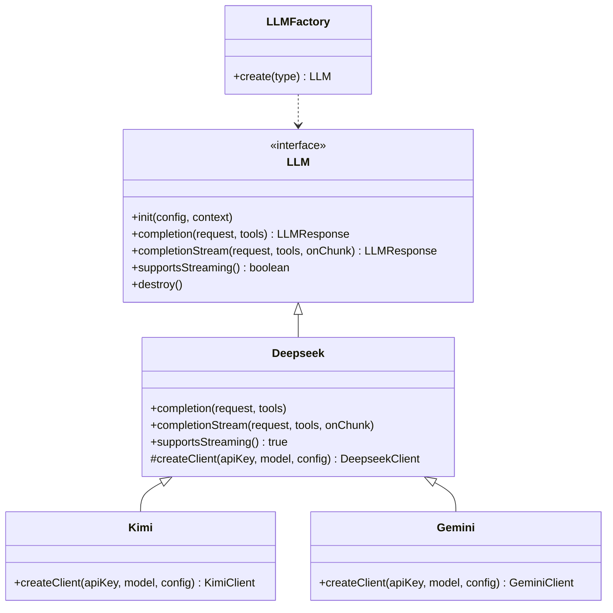

**Supported Providers:**

All providers share the base Deepseek implementation and support the OpenAI-compatible chat completion API:

| Provider | Streaming | Thinking Mode | Notes |
|----------|-----------|---------------|-------|
| **Deepseek** | ✅ | ✅ | Base implementation with full feature support |
| **Kimi** | ✅ | ✅ | Extends Deepseek with Kimi API endpoint |
| **Gemini** | ✅ | ✅ | Extends Deepseek with Gemini API endpoint |

**Configuration Example:**
```json
{
  "llm": {
    "type": "deepseek",
    "api-key": "${DEEPSEEK_API_KEY}",
    "model": "deepseek-chat",
    "temperature": 0.7,
    "max-tokens": 2048,
    "streaming": true,
    "thinking": false,
    "reasoning-effort": null,
    "read-timeout-millis": 60000,
    "connect-timeout-millis": 5000
  }
}
```

**Note:** All providers (Deepseek, Kimi, Gemini) share the same configuration structure since Kimi and Gemini extend Deepseek's implementation. Just change the `type` field and use the appropriate API key and model name for the chosen provider.

**Request Flow:**
1. Assistant creates `LLMRequest` with messages and available tool metadata
2. LLM provider formats request for specific API
3. API returns response with text and/or function calls
4. Response parsed into `LLMResponse` with choices, tool calls, usage stats
5. For streaming: chunks sent to callback, final response assembled

---

### Tool System

**Tools** extend assistant capabilities with external integrations and file operations.

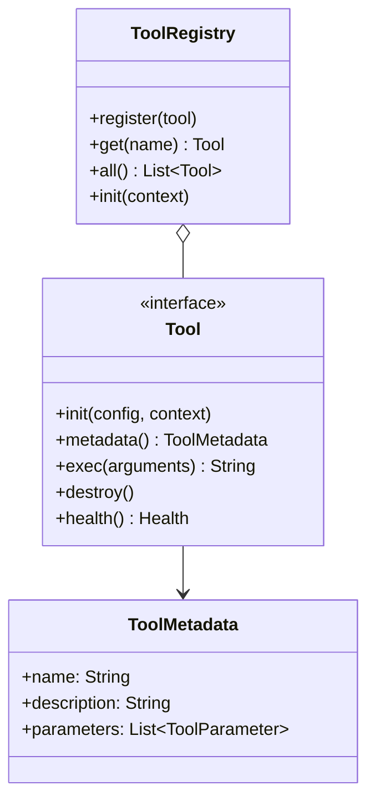

**Built-in Tools:**

| Category | Tool | Description |
|----------|------|-------------|
| **Web** | `web_search` | Search the web using search APIs |
| **Web** | `web_fetch` | Fetch and parse web page content |
| **Code** | `python` | Execute Python code via subprocess |
| **Code** | `shell` | Execute shell commands (with security restrictions) |
| **Files** | `file_read` | Read files from agent's workspace |
| **Files** | `file_write` | Write files to agent's workspace |
| **Files** | `file_edit` | Edit existing files in workspace |
| **Skills** | `skill_activation` | Dynamically activate skills during conversation |
| **Multi-Agent** | `swarm_delegate` | Delegate tasks to specialist agents |
| **Messaging** | `send_message` | Send messages to users via channels |

**Tool Lifecycle:**
1. **Discovery** - Tools discovered by `ContextFactory.discoverTools()`
2. **Registration** - Registered in `ToolRegistry`
3. **Initialization** - `init(config, context)` called with tool-specific config
4. **Metadata** - LLM receives tool metadata for function calling
5. **Execution** - `exec(arguments)` called when LLM requests tool use
6. **Result** - Returns string result added to iteration memory
7. **Cleanup** - `destroy()` called on shutdown

**Adding a New Tool:**

1. Create class implementing `Tool` interface:

```kotlin
class MyTool : Tool {
    override fun id() = "tool:my_tool"
    
    override fun metadata() = ToolMetadata(
        name = "my_tool",
        description = "What the tool does",
        parameters = listOf(
            ToolParameter("param1", "Description", ToolParameterType.STRING, true)
        )
    )
    
    override fun exec(arguments: Map<*, *>): String {
        val param1 = arguments["param1"]?.toString()
        // Implementation
        return "Result"
    }
}
```

2. Register in `ContextFactory.discoverTools()`:

```kotlin
private fun discoverTools() = listOf(
    // ... existing tools
    MyTool()
)
```

3. Optional: Add config file at `config/tools/my_tool.json`

---

### Skills System

**Skills** are modular, dynamically-activated extensions with custom tools and instructions.

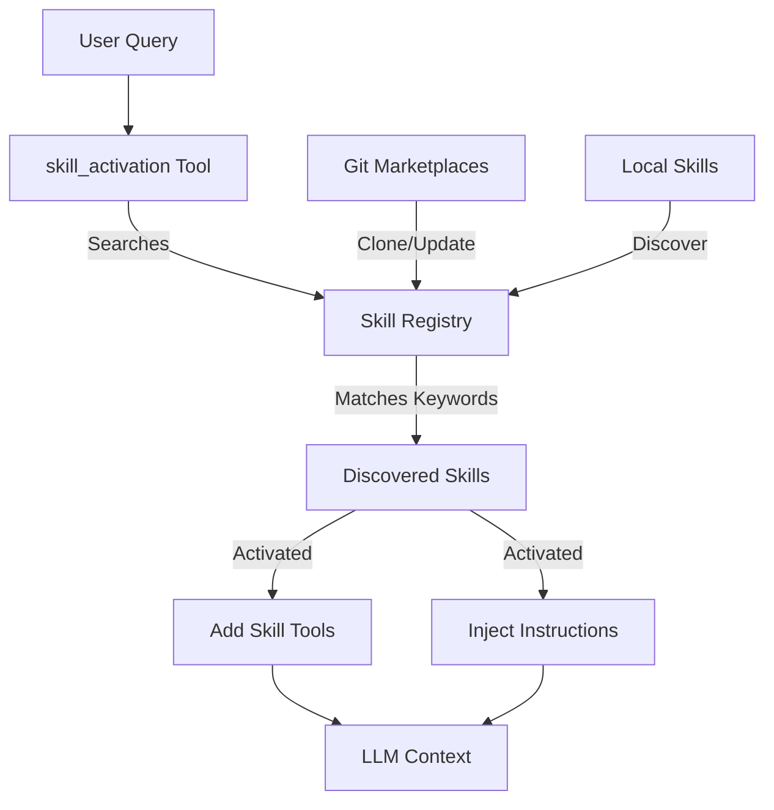

**Skill Discovery:**
- **Local skills:** `~/kokibot/agents/{agent}/skills/*/SKILL.md`
- **Marketplace skills:** Git repositories configured in `marketplaces` section
- Discovered at startup by `SkillRegistry`
- Parsed by `SkillParser` into `SkillMetadata`

**Skill Structure:**

```
~/kokibot/agents/{agent}/skills/
└── my-skill/
    ├── SKILL.md           # Skill definition (frontmatter + markdown)
    └── scripts/           # Tool implementations (optional)
        └── my_tool.py
```

**SKILL.md Format:**

```markdown
---
name: my-skill
description: Brief description
requires:
    bins: ["python3"]
    env: ["API_KEY"]
metadata:
    keywords: ["keyword1", "keyword2"]
    categories: ["category"]
tools:
  - name: my_tool
    description: Tool description
    parameters:
      - name: param1
        type: string
        description: Parameter description
        required: true
---

# My Skill

Detailed skill description and instructions.

## Usage

Instructions for the LLM on how to use this skill.

## Examples

User: "Example query"
Assistant: Call `my_tool(param="value")`
```

**Activation Flow:**
1. User sends query
2. LLM decides to call `skill_activation` tool with list of skill names
3. `SkillActivationTool` activates specified skills for this request
4. Skill tools added to available tools
5. Skill instructions injected into system prompt
6. LLM can now use skill tools

**Components:**
- `SkillRegistry` - Discovers and manages skills
- `SkillParser` - Parses SKILL.md into metadata
- `SkillActivationTool` - Tool for activating skills
- `SkillTool` - Wraps skill-defined tools as `Tool` instances
- `SkillCommand` - `/skill` command for listing/inspecting skills

---

### Channel System

**Channels** provide communication interfaces connecting users to assistants.

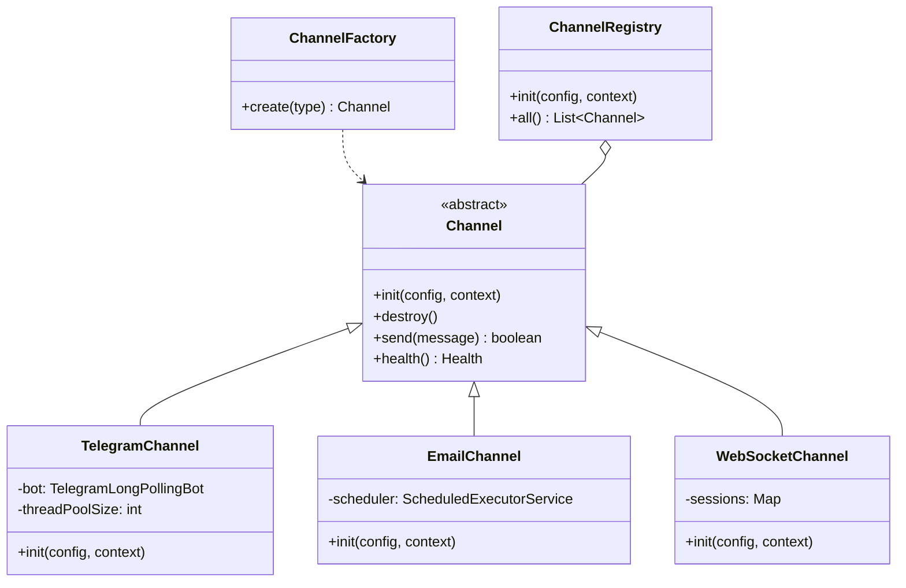

**Supported Channels:**

| Channel | Type | Polling | Streaming | Whitelist |
|---------|------|---------|-----------|-----------|
| **Telegram** | Messaging | Long polling | ✅ | Username-based |
| **Email** | Messaging | Periodic IMAP | ❌ | Email-based |
| **WebSocket** | Real-time | Push | ✅ | None |

**Message Flow:**
1. Channel receives message from external service
2. Channel creates `Message` object with userId, channelId, text, files
3. Channel calls `assistant.process(message, streamCallback)`
4. Assistant processes with reasoning loop
5. Assistant returns final `Message`
6. Channel sends response via `send(message)`
7. For streaming: callback sends intermediate results

**Telegram Channel:**
- Long polling for receiving messages
- Markdown→HTML conversion for formatting
- File upload/download support
- Thread pool for concurrent message processing
- Configurable sender whitelist

**Email Channel:**
- IMAP polling for incoming emails (configurable frequency)
- SMTP for sending replies
- Attachment support
- Thread-per-email processing
- Configurable sender whitelist

**WebSocket Channel:**
- Real-time bidirectional communication
- JSON message protocol
- Session management per user
- Streaming support via chunks
- Dynamic path configuration

**Configuration:**
```json
{
  "channels": [
    {
      "type": "telegram",
      "token": "${TELEGRAM_TOKEN}",
      "thread-pool-size": 4,
      "sender-whitelist": []
    },
    {
      "type": "email",
      "email": "bot@example.com",
      "username": "bot@example.com",
      "password": "${EMAIL_PASSWORD}",
      "imap-host": "imap.example.com",
      "imap-port": 993,
      "smtp-host": "smtp.example.com",
      "smtp-port": 465,
      "fetch-frequency": "15m",
      "sender-whitelist": []
    },
    {
      "type": "websocket",
      "path": "/ws/agent"
    }
  ]
}
```

---

### Memory System

**Multi-tier memory system** for conversation tracking and knowledge retention:

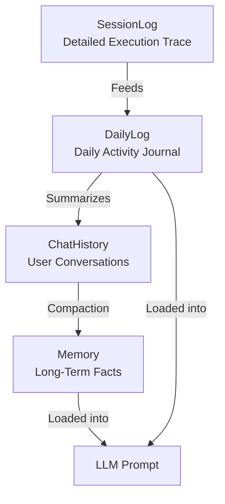

#### 1. SessionLog (`service/memory/SessionLog.kt`)

**Purpose:** Detailed execution trace for debugging and analysis

- **Storage:** `~/kokibot/agents/{agent}/memory/sessions/YYYY/MM/DD/{session-id}.jsonl`
- **Format:** JSON Lines (one JSON object per line)
- **Content:** User queries, LLM responses, tool calls, tool results, thinking, usage stats
- **Retention:** Permanent (no automatic cleanup)

**Logged Events:**
- Query with files, userId, channelId
- LLM response with content, reasoning, tool calls
- Tool use requests with arguments
- Tool execution results
- Model info and token usage
- Iteration memory state

**Use Cases:**
- Debugging tool execution
- Analyzing token usage and costs
- Understanding reasoning flow
- Auditing assistant behavior

---

#### 2. DailyLog (`service/memory/DailyLog.kt`)

**Purpose:** Human-readable daily activity journal

- **Storage:** `~/kokibot/agents/{agent}/memory/history/YYYY-MM-DD.md`
- **Format:** Structured Markdown
- **Content:** Daily objectives, activity stream, insights, blockers, next steps
- **Retention:** Persistent, grows daily
- **Thread-safety:** ReentrantReadWriteLock for concurrent access

**Structure:**
```markdown
# Daily Log - 2026-05-23

## 🎯 Daily Objectives
- [ ] Task 1
- [ ] Task 2

## 📝 Activity Stream
### 10:30 AM - Session abc123
**Intent:** User asked about...
**Action:** Executed tool...
**Result:** Completed successfully

## 💡 Knowledge Capture
- Learned that...
- Configuration changed...

## 🚧 Blockers & Next Steps
**Blockers:**
- Issue with...

**Next Steps:**
- Continue working on...
```

**Loaded into Prompt:** Yes (under "# Daily Log Protocol")

**Operations:**
- `get()` - Returns today's log content
- `clear()` - Deletes today's log

---

#### 3. ChatHistory (`service/memory/ChatHistory.kt`)

**Purpose:** Per-user, per-channel conversation storage

- **Storage:** `~/kokibot/agents/{agent}/memory/chat/{user-id}/{channel-id}/YYYY-MM-DD.md`
- **Format:** Markdown with session sections
- **Content:** User queries, assistant responses, file attachments
- **Retention:** Daily files, grows indefinitely
- **Thread-safety:** ReentrantReadWriteLock

**Structure:**
```markdown
# 2026-05-23T10:30:00Z: Session abc123
## user
### Query:
```markdown
What is the weather?
```
### Files:
- /path/to/file1.txt

## assistant
### Response:
```markdown
The weather is sunny.
```

---
```

**Operations:**
- `append(query, response)` - Appends conversation to daily log
- `clear(userId, channelId)` - Archives and clears history for user

---

#### 4. Memory (`service/memory/Memory.kt`)

**Purpose:** Long-term fact extraction and compaction

- **Storage:** `~/kokibot/agents/{agent}/memory/MEMORY.md`
- **Format:** Markdown document with key facts
- **Content:** Extracted facts, decisions, learnings from conversations
- **Retention:** Grows until `max-length`, then truncates
- **Thread-safety:** ReentrantLock for compaction serialization

**Compaction Process:**
1. Scheduler triggers every `compaction-frequency` (default: 6h)
2. Extracts last `window` period from DailyLog (default: 7d)
3. Sends to LLM with memory compaction prompt
4. LLM extracts key facts and information
5. Merges with existing `MEMORY.md`
6. Removes duplicates and outdated info
7. Truncates to `max-length` if needed

**Configuration:**
```json
{
  "memory": {
    "window": "3d",
    "compaction-frequency": "6h",
    "max-length": 10240
  }
}
```

**Commands:**
- `/compact` - Manually trigger compaction
- `/clear` - Clear chat history (doesn't affect Memory)

**Loaded into Prompt:** Yes (under "# Long-Term Memory")

---

### Marketplace System

**Marketplaces** are Git repositories containing reusable skills.

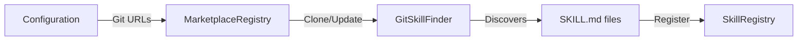

**Components:**
- `MarketplaceRegistry` - Manages marketplace lifecycle
- `GitSkillFinder` - Clones and discovers skills from Git repos
- `Marketplace` - Represents a single marketplace

**Configuration:**
```json
{
  "marketplaces": [
    {
      "url": "https://github.com/wutsi/kokibot-skills.git",
      "branch": "main"
    }
  ]
}
```

**Lifecycle:**
1. On initialization, registry reads `marketplaces` config
2. For each marketplace:
   - Clone Git repository to `~/kokibot/agents/{agent}/skills/marketplace-{hash}/`
   - Discover all `SKILL.md` files
   - Register skills in `SkillRegistry`
3. Skills from marketplaces treated identically to local skills
4. Repositories updated on restart

---

### Command System

**Commands** provide system-level functionality via `/command` syntax.

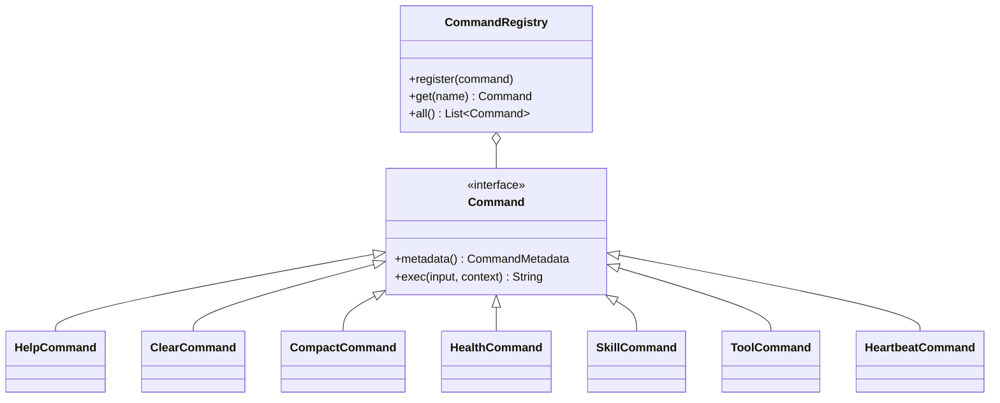

**Built-in Commands:**

| Command | Purpose |
|---------|---------|
| `/help [cmd]` | Display available commands or details about specific command |
| `/clear` | Clear conversation history for current user/channel |
| `/compact` | Manually trigger memory compaction |
| `/health` | System health check showing status of all components |
| `/skill [name]` | Show skill details or list all available skills |
| `/tool [name]` | Show tool details or list all available tools |
| `/heartbeat` | Manually trigger heartbeat task |

**Command Flow:**
1. User sends message starting with `/`
2. Assistant detects command syntax
3. `CommandRegistry` retrieves command by name
4. Command executes with input and context
5. Result returned directly to user (not via LLM)

---

### Heartbeat System

**Heartbeat** schedules periodic automated tasks for maintenance and monitoring.

**Components:**
- `Heartbeat` (`service/heartbeat/Heartbeat.kt`) - Scheduler and executor
- `HEARTBEAT.md` - User-defined heartbeat instructions

**Configuration:**
```json
{
  "heartbeat": {
    "frequency": "30m"
  }
}
```

**How It Works:**
1. On initialization, reads `frequency` from config
2. Schedules periodic task at specified interval
3. On each tick:
   - Reads `~/kokibot/agents/{agent}/HEARTBEAT.md`
   - Sends content as system message to assistant
   - Assistant processes instructions

**Example `HEARTBEAT.md`:**
```markdown
Check for pending tasks and log their status to the daily log.
If any critical issues found, report them.
```

**Use Cases:**
- System health monitoring
- Scheduled reports
- Cleanup tasks
- Reminder notifications

**Commands:**
- `/heartbeat` - Manually trigger heartbeat task

---

### File Service

**FileService** manages file operations for tools.

**Components:**
- `FileService` (`service/FileService.kt`) - File management
- File extractors - Extract text from various formats

**Supported Formats:**
- **Text:** `.txt`, `.md`, `.json`, `.xml`, `.csv`
- **Documents:** `.pdf`, `.doc`, `.docx`, `.ppt`, `.pptx`, `.xls`, `.xlsx`
- **Code:** `.kt`, `.java`, `.py`, `.js`, `.ts`, etc.
- **Web:** `.html`, `.htm`

**Operations:**
- Read files from workspace
- Write files to workspace
- Edit existing files
- Extract text from binary formats
- List files in directory

**Workspace:** `~/kokibot/agents/{agent}/workspace/files/`

---

## Data Flow

### Complete Request Flow

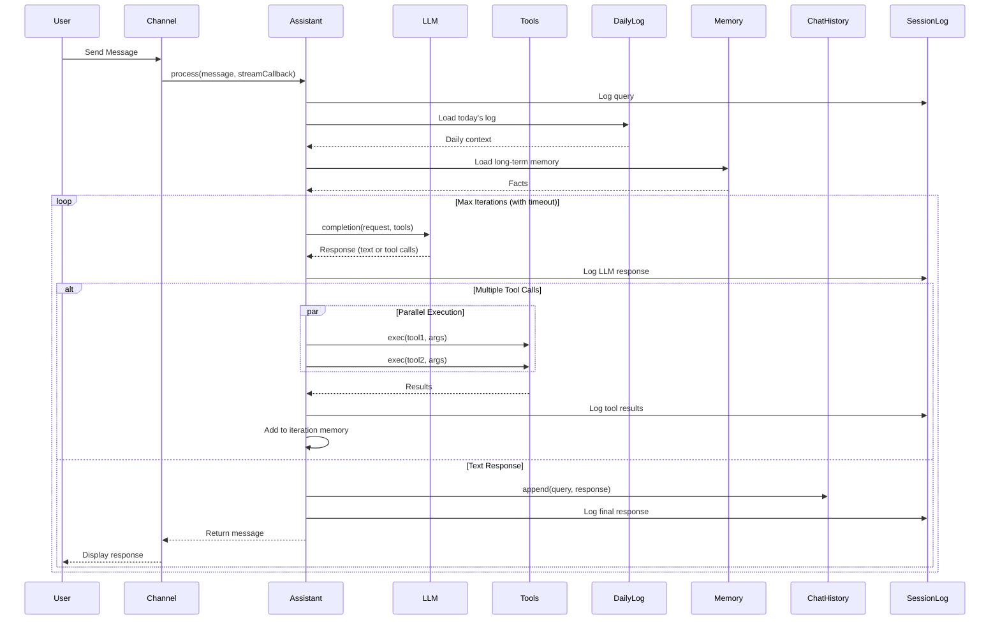

### Multi-Agent Delegation Flow

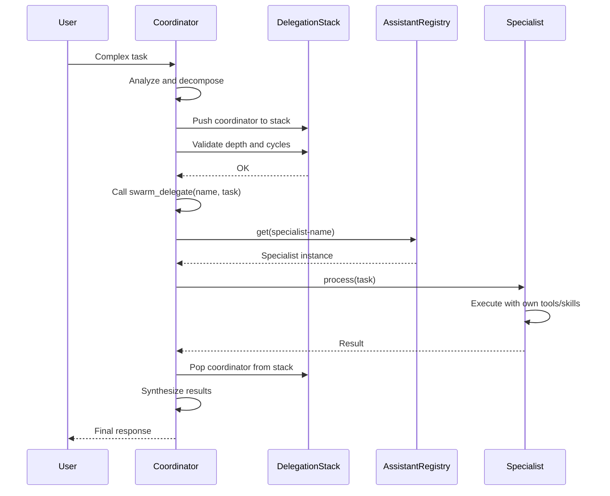

---

## Design Patterns

### Factory Pattern
- **LLMFactory** - Creates LLM provider instances based on type
- **ChannelFactory** - Creates communication channel instances
- **ContextFactory** - Creates and configures Context with all dependencies

### Registry Pattern
- **ToolRegistry** - Manages available tools
- **SkillRegistry** - Manages discovered skills
- **CommandRegistry** - Manages system commands
- **ChannelRegistry** - Manages active channels
- **MarketplaceRegistry** - Manages skill marketplaces
- **AssistantRegistry** - Manages multiple assistants (multi-agent)

### Strategy Pattern
- **Tool interface** - Different tool implementations
- **LLM interface** - Different LLM providers
- **Channel abstract class** - Different communication channels
- **Command interface** - Different system commands

### Template Method Pattern
- **Channel** - Defines communication flow, subclasses implement details
- **Tool** - Defines tool lifecycle, subclasses implement logic
- **Resource** - Defines initialization/cleanup, implementations provide specifics

### Observer Pattern
- **Streaming callbacks** - LLM streams chunks to channel
- **SessionLog** - Observes and logs all assistant events

---

## Technology Stack

### Core Framework
| Technology | Version | Purpose |
|------------|---------|---------|
| **Spring Boot** | 4.0.6 | Application framework, DI, lifecycle management |
| **Kotlin** | 2.3.21 | Primary language |
| **Java** | 17 | Runtime environment |

### LLM & AI
| Technology | Version | Purpose |
|------------|---------|---------|
| **Deepseek API** | - | Primary LLM provider with streaming |
| **Kimi API** | - | Alternative LLM provider |
| **Gemini API** | - | Alternative LLM provider |

### Communication
| Technology | Version | Purpose |
|------------|---------|---------|
| **Telegram Bots SDK** | 9.6.0 | Telegram Bot API integration |
| **Jakarta Mail API** | 2.1.5 | Email (IMAP/SMTP) functionality |
| **Spring WebSocket** | 4.0.6 | WebSocket real-time communication |

### Data Processing
| Technology | Version | Purpose |
|------------|---------|---------|
| **Jackson Kotlin** | 2.21.3 | JSON serialization/deserialization |
| **JSoup** | 1.22.2 | HTML parsing for web content |
| **Apache PDFBox** | 3.0.7 | PDF text extraction |
| **Apache POI** | 5.5.1 | Microsoft Office document parsing |
| **Flexmark** | 0.64.8 | Markdown/HTML conversion |
| **JGit** | 7.6.0 | Git operations for marketplaces |
| **OkHttp** | 5.3.2 | HTTP client for API calls |
| **Kotlinx Coroutines** | 1.11.0 | Asynchronous programming |

### Testing
| Technology | Version | Purpose |
|------------|---------|---------|
| **JUnit** | 5 | Unit testing framework |
| **Mockito Kotlin** | 2.2.0 | Mocking for tests |
| **GreenMail** | 2.1.8 | Email server testing |

---

## Security Considerations

### Shell Command Security (`ShellTool`)
- **Blacklist:** `sudo`, `rm -rf`, `chmod`, `chown`, `> /etc/`
- **Timeout:** Configurable (default: 5 seconds)
- **No redirection** to system directories
- **Whitelist-based** for production use recommended

### Python Execution (`PythonTool`)
- Executes via **subprocess** (isolated process)
- **Timeout protection**
- **No direct file system** access outside workspace
- Output captured and sanitized

### Configuration Security
- **Sensitive data** in environment variables only
- **No credentials** in code or config files checked into version control
- **Environment variable substitution:** `${VAR_NAME}`
- Config files should have restrictive permissions

### Channel Security
- **Whitelist support** for Telegram (username-based)
- **Whitelist support** for Email (email address-based)
- **WebSocket** currently has no authentication (use reverse proxy for auth)

### Multi-Agent Security
- **Delegation depth limits** prevent stack overflow
- **Cycle detection** prevents infinite delegation loops
- **Session isolation** prevents cross-session interference

---

## Performance

### Optimization Strategies
- **Tool metadata cached** in registries (loaded once at startup)
- **Skills discovered once** at startup, not per-request
- **Parallel tool execution** via thread pools
- **Memory compaction** runs asynchronously on schedule
- **JSON storage** for fast read/write of history
- **Thread-safe data structures** for concurrent access

### Scalability Considerations
- **Iterative reasoning loop** is single-threaded per request (intentional for determinism)
- **Multiple channels** supported concurrently
- **Multiple agents** run independently with isolated workspaces
- **Long-polling** for Telegram (efficient for low-to-medium traffic)
- **Thread pools** for Telegram message processing
- **Configurable timeouts** prevent runaway requests

### Resource Management
- **Thread pool sizing:** Configurable per assistant and channel
- **Graceful shutdown:** Proper cleanup of executors, connections
- **File handles:** Properly closed after operations
- **Memory limits:** Configurable max length for memory files

---

## Extension Points

Kokibot is designed for extensibility at multiple levels:

### 1. New Tools
Implement `Tool` interface and register in `ContextFactory.discoverTools()`

```kotlin
class MyTool : Tool {
    override fun metadata() = ToolMetadata(...)
    override fun exec(arguments: Map<*, *>): String { ... }
}
```

### 2. New Skills
Add `SKILL.md` to `~/kokibot/agents/{agent}/skills/` or publish in marketplace

### 3. New Channels
Extend `Channel` abstract class and register in `ChannelFactory.create()`

```kotlin
class MyChannel : Channel() {
    override fun init(config: Map<*, *>, context: Context) { ... }
}
```

### 4. New LLM Providers
Implement `LLM` interface and register in `LLMFactory.create()`

```kotlin
class MyLLM : LLM {
    override fun completion(request: LLMRequest, tools: List<Tool>): LLMResponse { ... }
}
```

### 5. New Commands
Implement `Command` interface and register in `ContextFactory.discoverCommands()`

```kotlin
class MyCommand : Command {
    override fun metadata() = CommandMetadata(...)
    override fun exec(input: String, context: Context): String { ... }
}
```

### 6. New Marketplaces
Add Git repository URL to `marketplaces` configuration section

### 7. New Agents
Create new directory under `~/kokibot/agents/` with `config/settings.json`

---

## See Also

- [README.md](README.md) - Project overview and quick start
- [CLAUDE.md](CLAUDE.md) - Development guidelines and implementation details
- [Configuration Guide](docs/CONFIGURATION.md) - Complete configuration reference

---

[← Back to Documentation](README.md) | [Configuration Guide →](docs/CONFIGURATION.md)
