# Architecture

This document provides a high-level overview of Kokibot's system architecture, including core components, data flow, and design patterns.

## Table of Contents
- [System Overview](#system-overview)
- [Core Components](#core-components)
- [Data Flow](#data-flow)
- [Subsystems](#subsystems)
- [Design Patterns](#design-patterns)
- [Technology Stack](#technology-stack)

---

## System Overview

Kokibot follows a **pluggable architecture** that allows for extensibility at multiple levels:

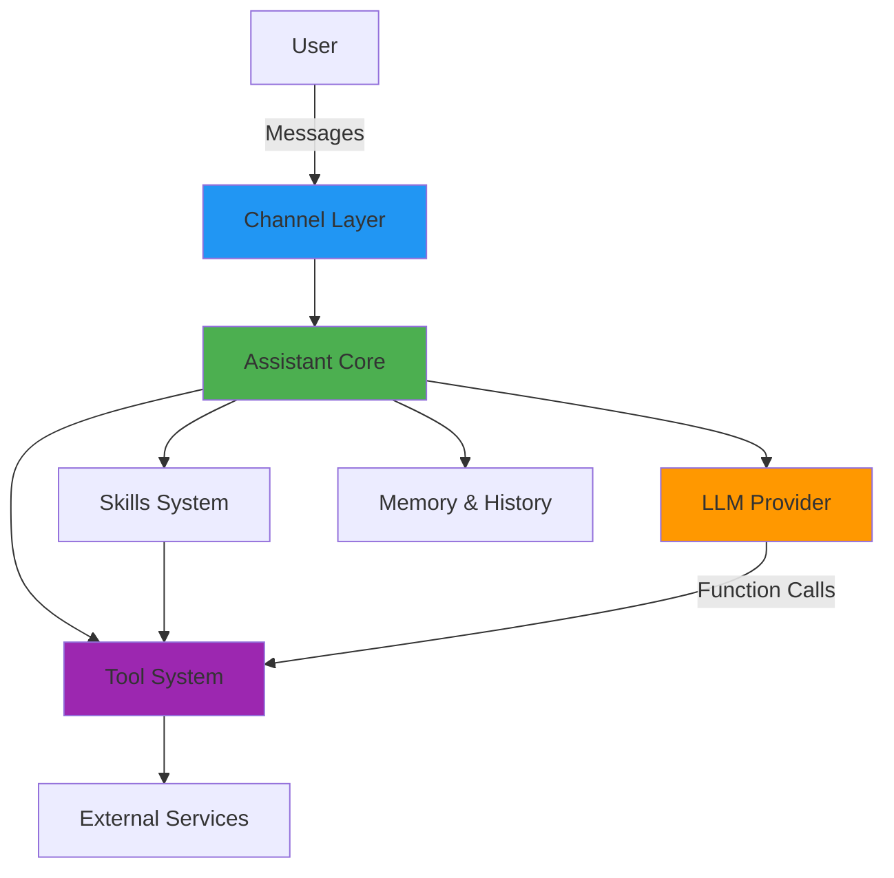

### Key Architectural Principles

1. **Modularity** - Components are loosely coupled and independently testable
2. **Extensibility** - New tools, skills, and channels can be added without modifying core code
3. **Iterative Reasoning** - Multi-step reasoning loop allows complex task decomposition
4. **Configuration-Driven** - Behavior controlled through JSON configuration files
5. **Memory & Context** - Maintains conversation history and long-term memory

---

## Core Components

### 1. Bootstrap (`Bootstrap.kt`)

**Responsibility:** Application initialization and lifecycle management

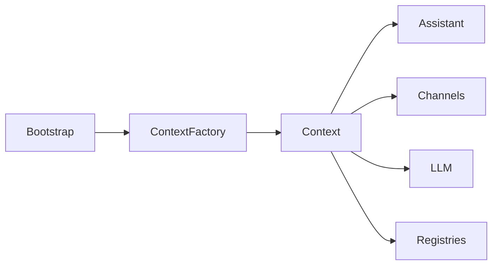

**Key Functions:**
- Initializes Spring Boot application
- Creates system `Context` via `ContextFactory`
- Loads configuration from `~/kokibot/config/settings.json`
- Manages lifecycle with `@PostConstruct` and `@PreDestroy` hooks
- Starts all configured channels

**Configuration:**
- Home directory: `~/kokibot` (configurable via `user.home` property)
- Settings file: `~/kokibot/config/settings.json`

---

### 2. Context (`Context.kt`)

**Responsibility:** Central state container and dependency injection

The Context object is passed to all components and contains:

| Component | Purpose |
|-----------|---------|
| `home` | Home directory path |
| `llm` | LLM provider instance |
| `toolRegistry` | Registry of available tools |
| `skillRegistry` | Registry of discovered skills |
| `commandRegistry` | Registry of system commands |
| `chatHistory` | Conversation history manager |
| `memory` | Long-term memory system |
| `smtp` | Email sending configuration |
| `imap` | Email reading configuration |
| `mapper` | JSON serialization/deserialization |

**Lifecycle Methods:**
- `init()` - Initialize all subsystems
- `destroy()` - Cleanup resources

---

### 3. Assistant (`Assistant.kt`)

**Responsibility:** Main reasoning loop and orchestration

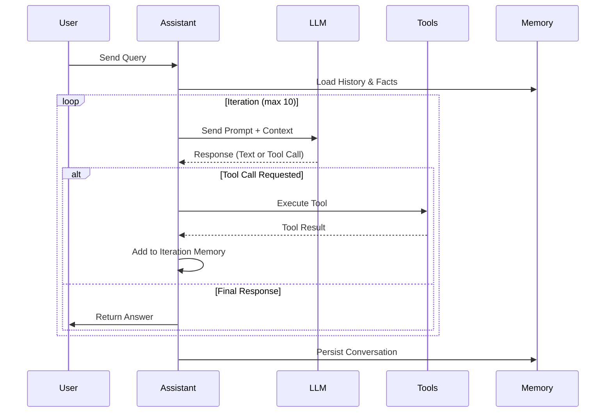

**Key Features:**
- **Iterative Reasoning** - Max 10 iterations (configurable)
- **Dynamic Skill Activation** - Matches user query to relevant skills
- **Command Handling** - Processes `/command` syntax
- **Tool Execution** - Coordinates tool calls from LLM
- **Memory Management** - Loads history and facts into prompts

**Prompt Structure:**
1. System instructions (from `~/kokibot/AGENT.md` if exists)
2. Activated skill instructions
3. User query
4. Previous reasoning steps (iteration memory)
5. Conversation history
6. Long-term memory facts

---

### 4. ContextFactory (`ContextFactory.kt`)

**Responsibility:** Factory for creating and configuring Context

```kotlin
ContextFactory
├── discoverTools()      // Register built-in tools
├── discoverCommands()   // Register built-in commands
├── createLLM()          // Create LLM instance
└── loadConfig()         // Load settings.json
```

**Discovered Components:**
- **Tools:** `clock`, `web_search`, `web_fetch`, `python`, `shell`, `mail_*`
- **Commands:** `/help`, `/clear`, `/compact`, `/skill`, `/tool`, `/health`
- **LLM:** Created based on `llm.type` configuration

---

## Subsystems

### LLM Integration

**Factory Pattern** for pluggable LLM providers:

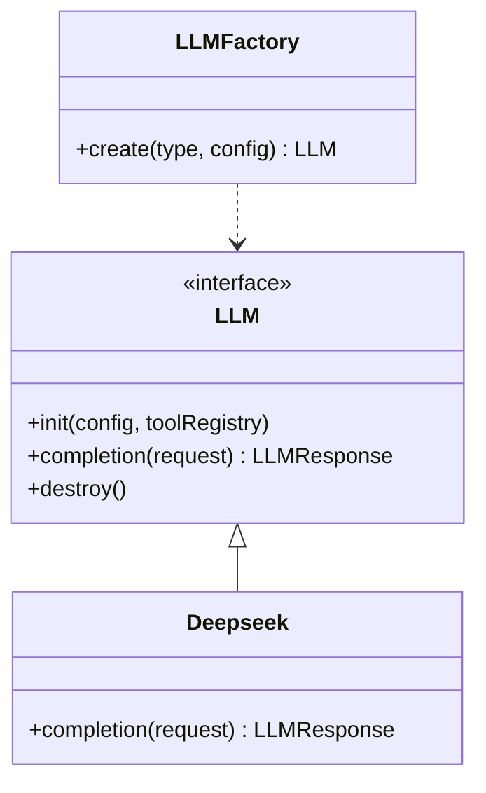

**Current Providers:**
- **Deepseek** - Function calling support, custom REST client

**Request Flow:**
1. Assistant creates `LLMRequest` with messages and available tools
2. LLM provider formats request for API
3. API returns response with text or function calls
4. Response parsed into `LLMResponse` with choices and tool calls

**Configuration:**
```json
{
  "llm": {
    "type": "deepseek",
    "api-key": "${DEEPSEEK_API_KEY}",
    "model": "deepseek-chat"
  }
}
```

---

### Tool System

**Tools** extend the assistant's capabilities with external integrations.

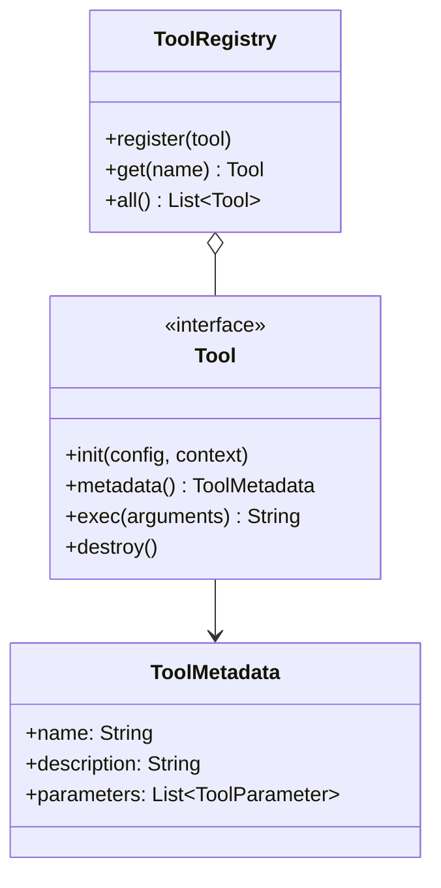

**Built-in Tools:**

| Category | Tools |
|----------|-------|
| **Time** | `clock` |
| **Web** | `web_search`, `web_fetch` |
| **Email** | `mail_list`, `mail_read`, `mail_send`, `mail_find`, `mail_unsubscribe` |
| **Code** | `python`, `shell` |

**Tool Lifecycle:**
1. **Registration** - Tools registered in `ToolRegistry` during initialization
2. **Metadata** - LLM receives tool metadata for function calling
3. **Execution** - Assistant calls `exec()` when LLM requests tool use
4. **Result** - Tool returns string result added to iteration memory

**Adding a New Tool:**

```kotlin
class MyTool : Tool {
    override fun metadata() = ToolMetadata(
        name = "my_tool",
        description = "What the tool does",
        parameters = listOf(
            ToolParameter("param1", "Description", ToolParameterType.STRING, true)
        )
    )
    
    override fun exec(arguments: Map<*, *>): String {
        val param1 = arguments["param1"]?.toString()
        // Implementation
        return "Result"
    }
}
```

Register in `ContextFactory.discoverTools()`:
```kotlin
private fun discoverTools() = listOf(
    ClockTool(),
    // ... existing tools
    MyTool()
)
```

---

### Skills System

**Skills** are modular extensions that dynamically activate based on user intent.

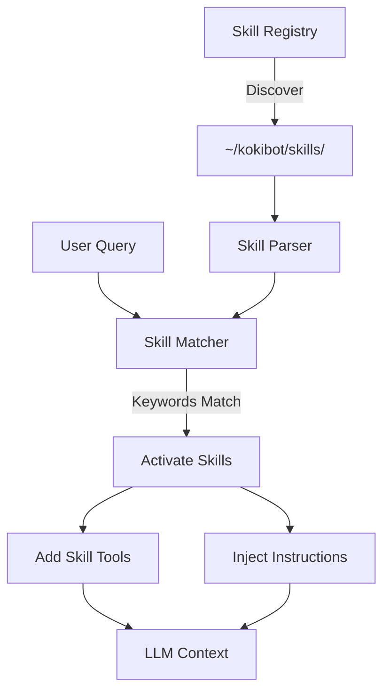

**Skill Structure:**

```
~/kokibot/skills/
└── my-skill/
    ├── SKILL.md           # Skill definition
    └── scripts/           # Tool implementations (optional)
        └── my_tool.py
```

**SKILL.md Format:**

```markdown
---
name: my-skill
description: Brief description
requires:
    bins: ["python3"]
    env: ["API_KEY"]
metadata:
    keywords: ["keyword1", "keyword2"]
    categories: ["category"]
---

# My Skill

Detailed description

## Tools

- `my_tool`: Tool description
    - `param`: (string) Parameter description

## Instructions

How to use this skill

## Examples

User: "Example query"
Action: Call `my_tool(param="value")`
```

**Activation Flow:**
1. User sends query
2. `SkillMatcher` checks keywords against registered skills
3. Matching skills activated for this request
4. Skill tools added to available tools
5. Skill instructions injected into system prompt

**Components:**
- `SkillRegistry` - Discovers skills from `~/kokibot/skills/*/SKILL.md`
- `SkillParser` - Parses SKILL.md into `SkillMetadata`
- `SkillMatcher` - Matches queries to skills by keywords
- `SkillTool` - Wraps skill-defined tools as `Tool` instances

---

### Channel System

**Channels** provide communication interfaces for the assistant.

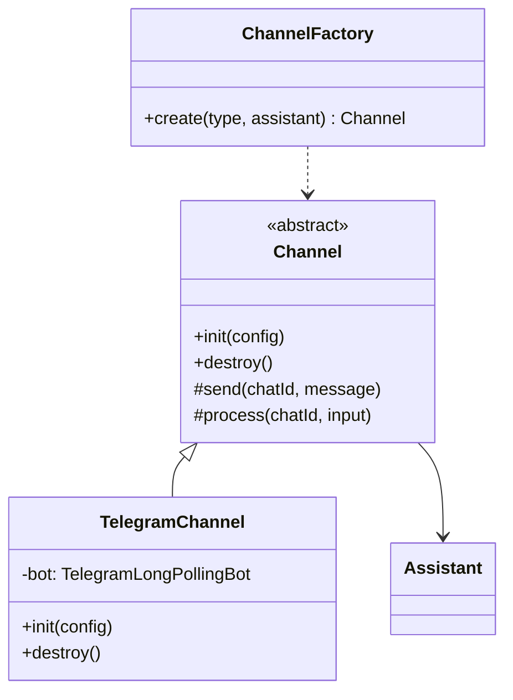

**Current Channels:**
- **Telegram** - Long polling integration with HTML formatting

**Message Flow:**
1. Channel receives message from external service
2. Channel calls `process(chatId, input)` 
3. Process delegates to `Assistant.process()`
4. Assistant returns response
5. Channel sends response via `send(chatId, message)`

**Configuration:**
```json
{
  "channels": [
    {
      "type": "telegram",
      "token": "${TELEGRAM_TOKEN}"
    }
  ]
}
```

**Adding a New Channel:**

```kotlin
class MyChannel(agent: Assistant) : Channel(agent) {
    override fun init(config: Map<*, *>) {
        // Initialize connection
    }
    
    override fun destroy() {
        // Cleanup
    }
}
```

Register in `ChannelFactory.create()`:
```kotlin
fun create(type: String, agent: Assistant) = when (type.lowercase()) {
    "telegram" -> TelegramChannel(agent)
    "mychannel" -> MyChannel(agent)
    else -> throw ConfigurationException("Unknown channel: $type")
}
```

---

### Memory & History

**Two-tier memory system** for conversation persistence:

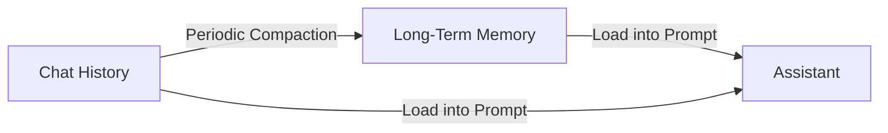

#### ChatHistory (`memory/ChatHistory.kt`)

**Purpose:** Short-term conversation persistence

- **Storage:** `~/kokibot/workspace/history/history.json`
- **Format:** JSON array of messages with roles and timestamps
- **Operations:**
  - `add(message)` - Append message to history
  - `list()` - Retrieve all messages
  - `merge(from, to)` - Extract date range
  - `clear()` - Delete all history

**Message Format:**
```json
{
  "role": "user|assistant",
  "content": "Message text",
  "timestamp": "2026-04-14T10:30:00Z"
}
```

#### Memory (`memory/Memory.kt`)

**Purpose:** Long-term fact extraction and storage

- **Storage:** `~/kokibot/workspace/memory/MEMORY.md`
- **Format:** Markdown document with extracted facts
- **Compaction:** Automatic every 6 hours (configurable)
- **Window:** Last 3 days of history (configurable)

**Compaction Process:**
1. Extract last N days of chat history
2. Send to LLM with compaction prompt
3. LLM extracts key facts and information
4. Merge with existing memory
5. Save updated MEMORY.md

**Configuration:**
```json
{
  "memory": {
    "window": 3,
    "compaction-frequency": 6
  }
}
```

**Commands:**
- `/clear` - Clear chat history
- `/compact` - Manually trigger memory compaction

---

### Command System

**Commands** provide system-level functionality via `/command` syntax.

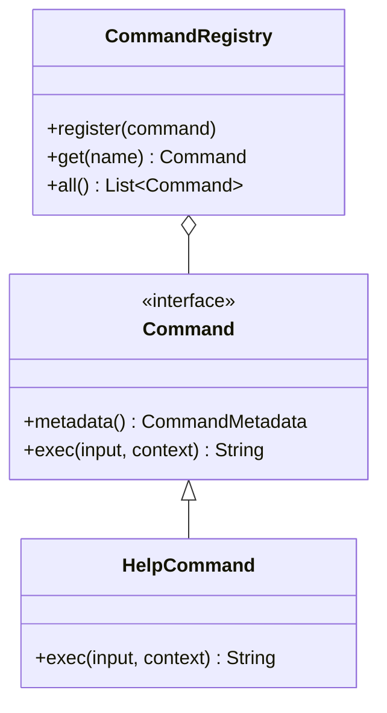

**Built-in Commands:**

| Command | Purpose |
|---------|---------|
| `/help [cmd]` | Display available commands or command details |
| `/clear` | Clear conversation history |
| `/compact` | Manually trigger memory compaction |
| `/health` | System health check |
| `/skill [name]` | Show skill details or list all skills |
| `/tool [name]` | Show tool details or list all tools |

**Command Flow:**
1. User sends message starting with `/`
2. Assistant detects command syntax
3. CommandRegistry retrieves command
4. Command executes with input and context
5. Result returned to user

---

## Data Flow

### Complete Request Flow

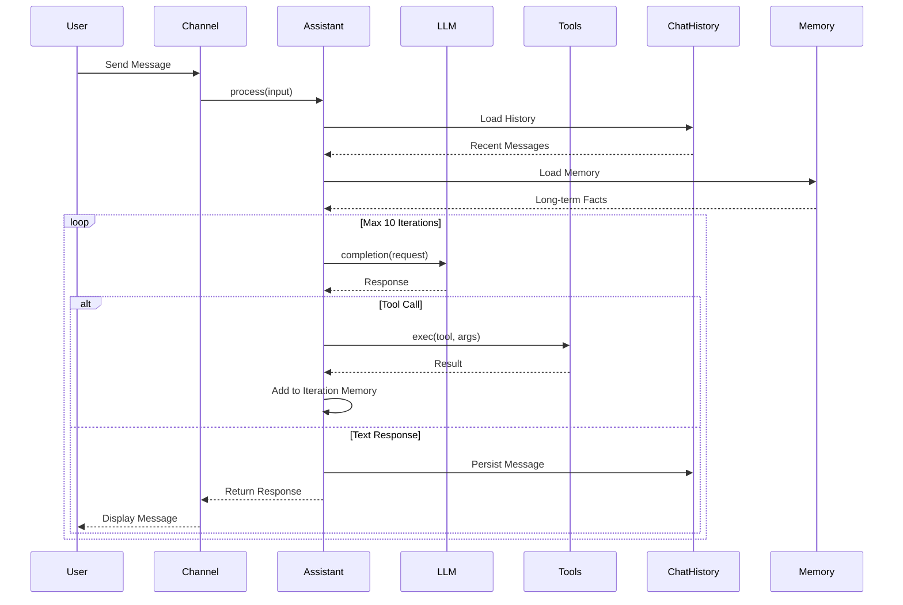

### Configuration Flow

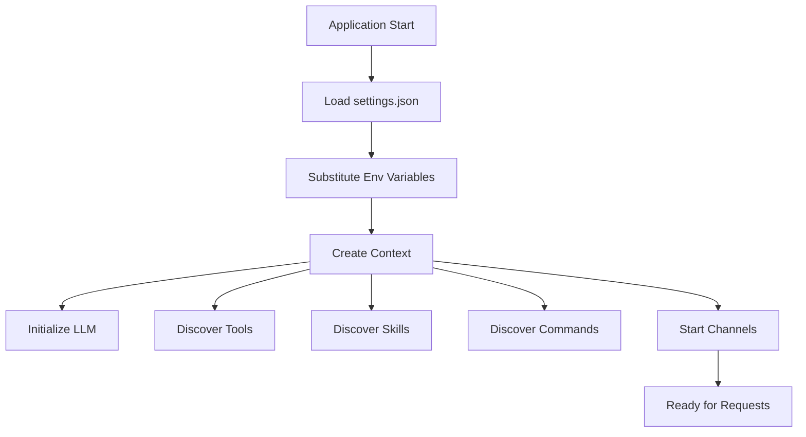

---

## Design Patterns

### Factory Pattern
- `LLMFactory` - Creates LLM providers
- `ChannelFactory` - Creates communication channels
- `ContextFactory` - Creates and configures Context

### Registry Pattern
- `ToolRegistry` - Manages available tools
- `SkillRegistry` - Manages discovered skills
- `CommandRegistry` - Manages system commands

### Strategy Pattern
- `Tool` interface - Different tool implementations
- `LLM` interface - Different LLM providers
- `Channel` abstract class - Different communication channels

### Template Method Pattern
- `Channel` - Defines communication flow, subclasses implement details
- `Tool` - Defines tool lifecycle, subclasses implement logic

---

## Technology Stack

### Core Framework
| Technology | Version | Purpose |
|------------|---------|---------|
| **Spring Boot** | 4.0.5 | Application framework |
| **Kotlin** | 2.2.0 | Primary language |
| **Java** | 17 | Runtime |

### LLM & AI
| Technology | Version | Purpose |
|------------|---------|---------|
| **Deepseek API** | - | LLM provider |
| **GraalVM Polyglot** | 25.0.2 | Python execution |

### Communication
| Technology | Version | Purpose |
|------------|---------|---------|
| **Telegram Bots SDK** | 9.5.0 | Telegram integration |
| **Jakarta Mail API** | 2.1.5 | Email functionality |

### Data Processing
| Technology | Version | Purpose |
|------------|---------|---------|
| **Jackson Kotlin** | 2.21.1 | JSON serialization |
| **JSoup** | 1.22.1 | HTML parsing |
| **Apache PDFBox** | 3.0.6 | PDF text extraction |
| **Apache POI** | 5.5.1 | Office document parsing |
| **Flexmark** | 0.64.8 | Markdown processing |

### Testing
| Technology | Version | Purpose |
|------------|---------|---------|
| **JUnit** | 5 | Test framework |
| **Mockito Kotlin** | 2.2.0 | Mocking |
| **GreenMail** | 2.1.8 | Email testing |

---

## Security Considerations

### Shell Command Security
- Blacklist: `sudo`, `rm -rf`, `chmod`, `chown`, `> /etc/`
- Timeout: 5 seconds default
- No pipe redirection to system directories

### Python Execution
- Sandboxed GraalVM context
- No file system access outside sandbox
- Limited execution time

### Configuration
- Sensitive data in environment variables
- No credentials in code or configuration files
- Environment variable substitution: `${VAR_NAME}`

---

## Performance

### Optimization Strategies
- Tool metadata cached in registries
- Skills discovered once at startup
- Conversation history stored as JSON (fast read/write)
- Memory compaction runs on schedule (non-blocking)

### Scalability Considerations
- Single-threaded reasoning loop (intentional for determinism)
- Multiple channels supported concurrently
- Long-polling for Telegram (efficient for low traffic)

---

## Extension Points

Kokibot is designed for extensibility:

1. **New Tools** - Implement `Tool` interface
2. **New Skills** - Add SKILL.md to `~/kokibot/skills/`
3. **New Channels** - Extend `Channel` abstract class
4. **New LLM Providers** - Implement `LLM` interface
5. **New Commands** - Implement `Command` interface

See [AGENT.md](../AGENT.md) for detailed implementation guides.

---

[← Back to Documentation](README.md) | [Setup Guide →](SETUP.md)
