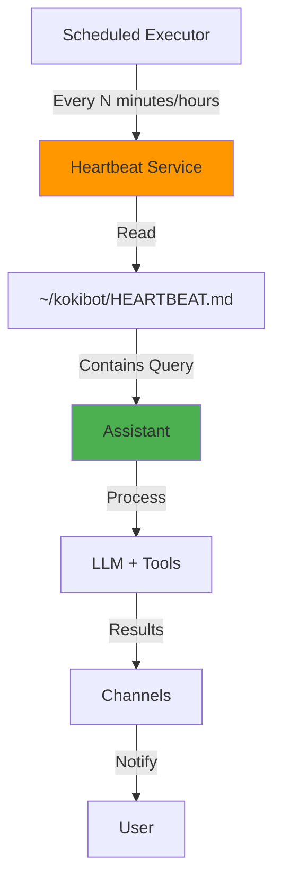

# Heartbeat Reference

This document provides comprehensive information about Kokibot's heartbeat system, which enables scheduled automated tasks and proactive monitoring.

## Table of Contents
- [Overview](#overview)
- [How It Works](#how-it-works)
- [Configuration](#configuration)
- [Use Cases](#use-cases)
- [Examples](#examples)
- [Best Practices](#best-practices)
- [Troubleshooting](#troubleshooting)

---

## Overview

### What is the Heartbeat System?

The heartbeat system is a **scheduled automation feature** that:
- Executes tasks on a regular interval
- Runs queries automatically without user interaction
- Enables proactive monitoring and notifications
- Executes system maintenance tasks

### Key Features

| Feature | Description |
|---------|-------------|
| **Scheduled Execution** | Run tasks at fixed intervals |
| **File-Based Configuration** | Define tasks in `HEARTBEAT.md` |
| **Full Tool Access** | Use all available tools and skills |
| **System Role** | Runs with elevated context |
| **Configurable Frequency** | From minutes to hours |

---

## How It Works

### Architecture



### Execution Flow

1. **Scheduler** triggers heartbeat at configured interval
2. **Heartbeat Service** checks for `~/kokibot/HEARTBEAT.md`
3. **If file exists**, reads the query/instructions
4. **Processes query** through Assistant (like a normal user request)
5. **Results sent** via configured channels
6. **Waits** for next interval

### System Role

Heartbeat runs with `Role.SYSTEM`, providing:
- Access to all tools and skills
- Full conversation history access
- No rate limiting
- Elevated permissions

---

## Configuration

### Basic Setup

**Step 1: Configure Frequency**

In `~/kokibot/config/settings.json`:

```json
{
  "heartbeat": {
    "frequency": "1h"
  }
}
```

**Step 2: Create Heartbeat File**

Create `~/kokibot/HEARTBEAT.md`:

```markdown
Check for urgent emails and notify me of any from my boss.
```

**Step 3: Restart Kokibot**

```bash
mvn spring-boot:run
```

The heartbeat will execute every hour.

---

### Frequency Configuration

#### Supported Formats

| Format | Example | Duration |
|--------|---------|----------|
| Minutes | `30m` | 30 minutes |
| Hours | `2h` | 2 hours |
| Mixed | `1h30m` | 1.5 hours |

#### Common Frequencies

```json
{
  "heartbeat": {
    "frequency": "15m"    // Every 15 minutes
  }
}
```

```json
{
  "heartbeat": {
    "frequency": "1h"     // Every 1 hour (default)
  }
}
```

```json
{
  "heartbeat": {
    "frequency": "6h"     // Every 6 hours
  }
}
```

```json
{
  "heartbeat": {
    "frequency": "24h"    // Daily
  }
}
```

---

### HEARTBEAT.md File

#### File Location

```
~/kokibot/HEARTBEAT.md
```

#### File Format

Plain text or Markdown containing the query/instructions:

**Simple Query:**
```markdown
Check if there are any critical system alerts.
```

**Detailed Instructions:**
```markdown
# Daily Monitoring

1. Check for urgent emails from team@company.com
2. Review any GitHub issues assigned to me
3. Check system health with /health
4. Summarize findings and notify if anything requires attention
```

**Conditional Logic:**
```markdown
Check my calendar for today. If I have meetings in the next hour, 
send me a reminder with details.
```

---

## Use Cases

### 1. Email Monitoring

Monitor inbox for important emails:

**HEARTBEAT.md:**
```markdown
Check my email for any messages from:
- boss@company.com
- team@company.com
- alerts@monitoring.com

If any emails found, summarize them and notify me.
```

**Frequency:** Every 15-30 minutes

---

### 2. System Health Monitoring

Regular system checks:

**HEARTBEAT.md:**
```markdown
Run /health to check system status.

If any component is down or unhealthy:
1. Log the details
2. Attempt to identify the issue
3. Notify me immediately with the problem and suggested fixes
```

**Frequency:** Every hour

---

### 3. Calendar Reminders

Proactive meeting reminders:

**HEARTBEAT.md:**
```markdown
Check my calendar for meetings in the next 2 hours.

For each upcoming meeting:
1. Send reminder with meeting details
2. Include list of attendees
3. Provide any related notes or documents
```

**Frequency:** Every 30 minutes during work hours

---

### 4. Task Management

Daily task review:

**HEARTBEAT.md:**
```markdown
# Daily Task Summary

1. Check for overdue tasks
2. List today's priorities
3. Identify any blockers or dependencies
4. Suggest task order based on urgency and importance

Send summary at start of day.
```

**Frequency:** Daily at specific time (requires time-aware logic)

---

### 5. Web Monitoring

Monitor websites for changes:

**HEARTBEAT.md:**
```markdown
Check these websites for updates:
- https://status.example.com/incidents
- https://company.com/news

If any new content detected:
1. Summarize the update
2. Assess impact or relevance
3. Notify me if important
```

**Frequency:** Every 1-2 hours

---

### 6. GitHub Activity

Monitor repository activity:

**HEARTBEAT.md:**
```markdown
Check GitHub for:
1. New issues assigned to me
2. Pull requests awaiting my review
3. Comments on my issues or PRs

Summarize any new activity and notify if action required.
```

**Frequency:** Every hour

---

### 7. News Digest

Daily news summary:

**HEARTBEAT.md:**
```markdown
Search for today's top news in:
- Technology
- AI/Machine Learning
- Kotlin/JVM ecosystem

Provide 5-bullet summary of most relevant items.
```

**Frequency:** Daily (24h)

---

### 8. Memory Compaction

Automated maintenance:

**HEARTBEAT.md:**
```markdown
/compact

If successful, confirm memory compaction completed.
```

**Frequency:** Every 6 hours

---

## Examples

### Example 1: Email Alert System

**Goal:** Monitor inbox for urgent emails

**Configuration:**
```json
{
  "heartbeat": {
    "frequency": "15m"
  }
}
```

**HEARTBEAT.md:**
```markdown
Check for urgent emails using mail_find:
- From: priority@company.com
- Subject containing: "URGENT", "CRITICAL", or "IMMEDIATE"
- Since: last 15 minutes

If any found:
1. Read full content with mail_read
2. Summarize key points
3. Assess urgency level
4. Notify me immediately

If none found, skip notification.
```

---

### Example 2: System Maintenance

**Goal:** Regular health checks and cleanup

**Configuration:**
```json
{
  "heartbeat": {
    "frequency": "1h"
  }
}
```

**HEARTBEAT.md:**
```markdown
# Hourly System Maintenance

1. Run /health to check all components
2. If any issues detected:
   - Log error details
   - Attempt basic troubleshooting
   - Notify me with findings

3. Every 6 hours (if current hour % 6 == 0):
   - Run /compact for memory compaction
   - Clear old temporary files if any

4. Report status: "All systems operational" or list issues
```

---

### Example 3: Meeting Preparation

**Goal:** Prepare for upcoming meetings

**Configuration:**
```json
{
  "heartbeat": {
    "frequency": "30m"
  }
}
```

**HEARTBEAT.md:**
```markdown
Check calendar for meetings in next 60 minutes.

For each meeting:
1. List attendees and purpose
2. Search email for related threads using mail_find
3. Gather relevant documents or notes
4. Prepare summary brief

Send notification 30 minutes before meeting with:
- Meeting details
- Key discussion points
- Action items from previous meetings
- Relevant context
```

---

### Example 4: Conditional Monitoring

**Goal:** Adaptive monitoring based on context

**Configuration:**
```json
{
  "heartbeat": {
    "frequency": "15m"
  }
}
```

**HEARTBEAT.md:**
```markdown
# Smart Monitoring

Current time: [system will provide]

IF time is between 9 AM - 5 PM (work hours):
  - Check email every 15 minutes
  - Monitor calendar
  - Check team chat for mentions

ELSE IF time is between 5 PM - 9 AM (off hours):
  - Only check for URGENT emails
  - Only notify for critical system alerts
  - Skip routine updates

Weekend: Skip all notifications unless CRITICAL
```

---

## Best Practices

### Frequency Selection

✅ **Do:**
- Start with longer intervals (1h+)
- Adjust based on needs
- Consider API rate limits
- Balance responsiveness vs resource usage

❌ **Don't:**
- Use very short intervals (<5m) unnecessarily
- Set up redundant heartbeats
- Ignore resource consumption
- Forget about time zones

### Query Design

✅ **Do:**
- Be specific and clear
- Include conditional logic
- Specify notification preferences
- Handle "no action needed" cases
- Use available tools efficiently

❌ **Don't:**
- Write vague queries
- Spam with every check
- Ignore edge cases
- Assume tools are available
- Create infinite loops

### Notification Management

**Smart Notifications:**
```markdown
If any urgent items found:
  - Notify immediately
  
If normal priority items:
  - Accumulate and send digest
  
If nothing important:
  - Skip notification (don't spam)
```

**Avoid Notification Fatigue:**
- Only notify when action needed
- Use different urgency levels
- Batch non-urgent updates
- Provide clear context

---

## Monitoring

### Check Heartbeat Status

**Via Health Command:**
```
/health
```

Response includes heartbeat status:
```json
{
  "heartbeat": {
    "status": "ok",
    "frequency": "1h",
    "last_tick": "2026-04-14T10:00:00Z",
    "next_tick": "2026-04-14T11:00:00Z"
  }
}
```

### Application Logs

Monitor heartbeat execution:

```
[INFO] Scheduling Heartbeat every 1h (3600000 ms)
[INFO] Heartbeat tick
[INFO] Tick
[INFO] Processing heartbeat query from HEARTBEAT.md
```

---

## Troubleshooting

### Heartbeat Not Running

**Problem:** No heartbeat execution logs

**Solutions:**
1. Verify `HEARTBEAT.md` exists:
   ```bash
   ls ~/kokibot/HEARTBEAT.md
   ```

2. Check configuration:
   ```json
   {
     "heartbeat": {
       "frequency": "1h"
     }
   }
   ```

3. Restart Kokibot:
   ```bash
   mvn spring-boot:run
   ```

4. Check logs for errors

---

### Empty HEARTBEAT.md

**Problem:** File exists but empty

**Solution:**
If `HEARTBEAT.md` is empty, heartbeat skips execution (no-op).

Add content:
```bash
echo "Check system health with /health" > ~/kokibot/HEARTBEAT.md
```

---

### Heartbeat Failures

**Problem:** Heartbeat runs but fails

**Logs:**
```
[ERROR] Heartbeat execution failed: [error message]
```

**Solutions:**
1. **Query Error:** Simplify query, test manually first
2. **Tool Not Available:** Check tool configuration
3. **API Errors:** Verify credentials and rate limits
4. **Timeout:** Reduce query complexity

---

### Notification Issues

**Problem:** Heartbeat runs but no notifications

**Solutions:**
1. Check channel configuration (Telegram, etc.)
2. Verify query explicitly sends notifications
3. Test channel manually
4. Review query logic for conditional notification

---

### High Resource Usage

**Problem:** Heartbeat consuming too many resources

**Solutions:**
1. Increase frequency interval
2. Optimize query complexity
3. Limit tool usage
4. Add conditional logic
5. Monitor API usage

---

## Advanced Topics

### Time-Aware Heartbeats

Use current time in logic:

```markdown
Check current time.

If Monday-Friday and 9 AM - 5 PM:
  [work hours logic]
Else:
  [off hours logic]
```

### Multi-Task Heartbeats

Combine multiple tasks:

```markdown
# Daily Routine

## Morning (if time is 8 AM):
1. Check email digest
2. Review calendar
3. Summarize priorities

## Afternoon (if time is 2 PM):
1. Review progress
2. Check for urgent items

## Evening (if time is 6 PM):
1. End-of-day summary
2. Tomorrow's prep
```

### Error Recovery

Handle failures gracefully:

```markdown
Try to check email for urgent messages.

If mail_find fails:
  - Log the error
  - Skip this check
  - Continue with other tasks

If critical error:
  - Notify me of the failure
  - Include error details
  - Suggest manual intervention
```

---

## Integration Examples

### With Email Tools

```markdown
Use mail_find to search for emails since last check.
Use mail_read to get full content of important emails.
Use mail_send to auto-respond if needed.
```

### With Web Tools

```markdown
Use web_search to check for latest news.
Use web_fetch to retrieve specific pages.
Compare with previous results (if stored in memory).
```

### With Custom Skills

```markdown
Activate [skill-name] skill.
Use skill-specific tools for domain tasks.
Process results and summarize findings.
```

---

## Disabling Heartbeat

### Temporary Disable

Remove or rename `HEARTBEAT.md`:

```bash
mv ~/kokibot/HEARTBEAT.md ~/kokibot/HEARTBEAT.md.disabled
```

### Permanent Disable

Remove heartbeat configuration:

```json
{
  "heartbeat": null
}
```

Or omit the section entirely.

---

## Future Enhancements

### Planned Features

🔄 **Cron-Style Scheduling**
- Specific times: "Every day at 9 AM"
- Complex schedules: "Weekdays at 8 AM and 5 PM"

🔄 **Multiple Heartbeats**
- Different tasks at different intervals
- Independent heartbeat files

🔄 **Conditional Execution**
- Skip execution based on conditions
- Dynamic frequency adjustment

🔄 **State Persistence**
- Remember last execution results
- Compare changes over time
- Avoid duplicate notifications

---

## See Also

- [Architecture](../ARCHITECTURE.md) - Heartbeat system design
- [Tools Reference](tools.md) - Available tools for heartbeats
- [Commands Reference](commands.md) - System commands
- [Mail Reference](mail.md) - Email integration

---

[← Mail Reference](mail.md) | [Commands Reference →](commands.md)
