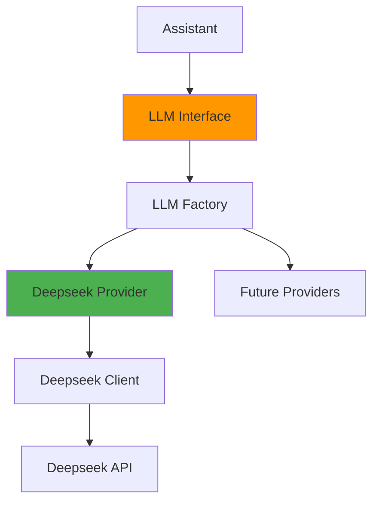

# LLM Reference

This document provides comprehensive information about Large Language Model (LLM) integration, configuration, and optimization in Kokibot.

## Table of Contents
- [Overview](#overview)
- [Supported Providers](#supported-providers)
- [Configuration](#configuration)
- [Deepseek](#deepseek)
- [Adding New Providers](#adding-new-providers)
- [Performance Tuning](#performance-tuning)
- [Troubleshooting](#troubleshooting)

---

## Overview

### What is the LLM Integration?

The LLM (Large Language Model) integration is the core reasoning engine of Kokibot. It:
- Processes user queries and generates responses
- Decides when and how to use tools
- Maintains conversation context
- Performs multi-step reasoning

### Architecture



### Key Components

| Component | Purpose |
|-----------|---------|
| **LLM Interface** | Abstract interface for all providers |
| **LLMFactory** | Creates appropriate LLM provider |
| **Deepseek** | Current implementation |
| **LLMRequest** | Request structure with messages |
| **LLMResponse** | Response with text or tool calls |

---

## Supported Providers

### Current Support

| Provider | Status | Function Calling | Streaming |
|----------|--------|-----------------|-----------|
| **Deepseek** | ✅ Supported | ✅ Yes | ❌ No |
| **OpenAI** | 🔄 Planned | - | - |
| **Anthropic** | 🔄 Planned | - | - |
| **Google Gemini** | 🔄 Planned | - | - |

### Provider Selection

The provider is selected in `settings.json`:

```json
{
  "llm": {
    "type": "deepseek"
  }
}
```

---

## Configuration

### Basic Configuration

Minimum required configuration in `~/kokibot/config/settings.json`:

```json
{
  "llm": {
    "type": "deepseek",
    "api-key": "${DEEPSEEK_API_KEY}",
    "model": "deepseek-chat"
  }
}
```

### Advanced Configuration

Complete configuration options:

```json
{
  "llm": {
    "type": "deepseek",
    "api-key": "${DEEPSEEK_API_KEY}",
    "model": "deepseek-chat",
    "thinking": false,
    "max-tokens": 4096,
    "temperature": 0.7,
    "read-timeout-millis": 60000,
    "connect-timeout-millis": 5000
  }
}
```

### Configuration Parameters

| Parameter | Type | Default | Description |
|-----------|------|---------|-------------|
| `type` | string | - | LLM provider (required) |
| `api-key` | string | - | API key (required) |
| `model` | string | - | Model name (required) |
| `thinking` | boolean | false | Enable thinking mode |
| `max-tokens` | integer | - | Max response tokens |
| `temperature` | float | - | Sampling temperature (0-1) |
| `read-timeout-millis` | integer | 60000 | Read timeout (ms) |
| `connect-timeout-millis` | integer | 5000 | Connect timeout (ms) |

### Environment Variables

Use environment variables for sensitive data:

```bash
export DEEPSEEK_API_KEY="your-api-key-here"
```

Configuration automatically substitutes `${VARIABLE_NAME}`:

```json
{
  "api-key": "${DEEPSEEK_API_KEY}"
}
```

---

## Deepseek

### Overview

Deepseek is the currently supported LLM provider. It provides:
- High-quality text generation
- Function calling support
- Competitive pricing
- Fast response times

### Getting Started

**Step 1: Get API Key**

1. Visit [Deepseek Platform](https://platform.deepseek.com/)
2. Create an account or sign in
3. Navigate to API Keys section
4. Generate a new API key

**Step 2: Configure Kokibot**

```json
{
  "llm": {
    "type": "deepseek",
    "api-key": "${DEEPSEEK_API_KEY}",
    "model": "deepseek-chat"
  }
}
```

**Step 3: Set Environment Variable**

```bash
export DEEPSEEK_API_KEY="sk-xxxxxxxxxxxxx"
```

### Available Models

| Model | Description | Use Case |
|-------|-------------|----------|
| `deepseek-chat` | Standard chat model | General conversation |
| `deepseek-coder` | Code-specialized model | Code generation |

### Features

#### Function Calling

Deepseek supports function calling for tool execution:

```json
{
  "tools": [
    {
      "name": "web_search",
      "description": "Search the web",
      "parameters": {
        "query": "string"
      }
    }
  ]
}
```

The model can decide to call tools based on context:

```
User: Search for latest AI news
Model: [calls web_search(query="latest AI news")]
```

#### Thinking Mode

Enable reasoning transparency:

```json
{
  "llm": {
    "thinking": true
  }
}
```

**Effect:**
- Model shows internal reasoning process
- Helps debug decision-making
- Increases response time

### API Endpoints

Deepseek API base URL:
```
https://api.deepseek.com/v1
```

**Endpoints used:**
- `/chat/completions` - Chat completions

### Rate Limits

Check current rate limits on [Deepseek Platform](https://platform.deepseek.com/).

**Typical Limits:**
- Requests per minute: varies by plan
- Tokens per minute: varies by plan

### Pricing

See [Deepseek Pricing](https://platform.deepseek.com/pricing) for current rates.

**Typical Pricing (as reference):**
- Input tokens: $X per 1M tokens
- Output tokens: $Y per 1M tokens

---

## Adding New Providers

### Step 1: Implement LLM Interface

Create a new provider class:

```kotlin
package com.wutsi.kokibot.llm.myprovider

import com.wutsi.kokibot.Context
import com.wutsi.kokibot.Health
import com.wutsi.kokibot.llm.LLM
import com.wutsi.kokibot.llm.LLMRequest
import com.wutsi.kokibot.llm.LLMResponse
import com.wutsi.kokibot.tools.Tool

class MyProvider : LLM {
    override fun id(): String = "llm:myprovider"
    
    override fun init(config: Map<*, *>, context: Context) {
        // Initialize client with API key, model, etc.
    }
    
    override fun health(): Health {
        // Check provider connectivity
        return Health(id = id())
    }
    
    override fun completion(request: LLMRequest, tools: List<Tool>): LLMResponse {
        // Call provider API
        // Convert tools to provider format
        // Parse response
        return LLMResponse(/* ... */)
    }
}
```

### Step 2: Register Provider

Add to `LLMFactory.create()`:

```kotlin
fun create(type: String, config: Map<*, *>, context: Context): LLM {
    return when (type.lowercase()) {
        "deepseek" -> Deepseek()
        "myprovider" -> MyProvider()
        else -> throw ConfigurationException("Unknown LLM type: $type")
    }.apply {
        init(config, context)
    }
}
```

### Step 3: Configure

```json
{
  "llm": {
    "type": "myprovider",
    "api-key": "${MY_API_KEY}",
    "model": "model-name"
  }
}
```

### LLM Interface Contract

```kotlin
interface LLM : Resource {
    fun completion(request: LLMRequest, tools: List<Tool>): LLMResponse
}
```

**Methods:**

| Method | Purpose | Required |
|--------|---------|----------|
| `id()` | Unique provider ID | Yes |
| `init(config, context)` | Initialize provider | Yes |
| `health()` | Health check | Yes |
| `completion(request, tools)` | Generate completion | Yes |
| `destroy()` | Cleanup resources | Optional |

---

## Performance Tuning

### Temperature

Controls randomness in responses:

```json
{
  "temperature": 0.7
}
```

**Guidelines:**
- `0.0-0.3` - Deterministic, factual responses
- `0.4-0.7` - Balanced creativity and accuracy
- `0.8-1.0` - Creative, varied responses

**Use Cases:**
- **Low (0.2):** Code generation, data extraction
- **Medium (0.7):** General conversation, assistance
- **High (0.9):** Creative writing, brainstorming

### Max Tokens

Limits response length:

```json
{
  "max-tokens": 4096
}
```

**Guidelines:**
- Smaller values: Faster responses, lower cost
- Larger values: More detailed responses
- Default: Provider-specific

**Typical Values:**
- Short answers: 512
- Standard responses: 2048
- Detailed explanations: 4096

### Timeouts

Configure network timeouts:

```json
{
  "read-timeout-millis": 60000,
  "connect-timeout-millis": 5000
}
```

**Read Timeout:**
- Time to wait for response
- Increase for complex queries
- Default: 60 seconds

**Connect Timeout:**
- Time to establish connection
- Usually keep at 5 seconds
- Default: 5 seconds

### Context Optimization

**Keep Prompts Concise:**
- Remove unnecessary history
- Use memory compaction
- Clear old conversations with `/clear`

**Use Memory Wisely:**
- Configure memory window: `"memory": { "window": 3 }`
- Regular compaction: `"compaction-frequency": 6`
- Manual compaction: `/compact`

---

## Monitoring

### Health Checks

Check LLM provider health:

```
/health
```

Response includes LLM status:
```json
{
  "llm": {
    "status": "ok",
    "provider": "deepseek",
    "model": "deepseek-chat"
  }
}
```

### Logs

Monitor LLM interactions in application logs:

```
[INFO] LLM Request: {messages: [...], tools: [...]}
[INFO] LLM Response: {choices: [...]}
```

### Error Tracking

Common error patterns:

**API Errors:**
```
ERROR: LLM API error: 401 Unauthorized
```

**Timeout Errors:**
```
ERROR: LLM timeout after 60000ms
```

**Rate Limit Errors:**
```
ERROR: Rate limit exceeded: 429 Too Many Requests
```

---

## Best Practices

### API Keys

✅ **Do:**
- Store in environment variables
- Use different keys for dev/prod
- Rotate keys regularly
- Monitor usage

❌ **Don't:**
- Commit keys to version control
- Share keys publicly
- Use production keys in testing
- Hardcode in configuration files

### Cost Optimization

**Strategies:**

1. **Use Memory Compaction**
   - Reduces prompt size
   - Maintains context
   - Lower token costs

2. **Limit Max Tokens**
   - Set reasonable limits
   - Adjust per use case
   - Monitor actual usage

3. **Clear Old History**
   - Use `/clear` regularly
   - Remove irrelevant context
   - Keep conversations focused

4. **Choose Right Model**
   - Smaller models for simple tasks
   - Larger models for complex reasoning
   - Code models for programming

### Error Handling

**Implement Retry Logic:**

```kotlin
fun completionWithRetry(request: LLMRequest, tools: List<Tool>): LLMResponse {
    var attempts = 0
    while (attempts < 3) {
        try {
            return completion(request, tools)
        } catch (e: TimeoutException) {
            attempts++
            Thread.sleep(1000 * attempts) // Exponential backoff
        }
    }
    throw Exception("Max retries exceeded")
}
```

**Graceful Degradation:**
- Catch API errors
- Provide fallback responses
- Notify user of issues

---

## Troubleshooting

### API Key Issues

**Problem: Authentication Failed**
```
ERROR: 401 Unauthorized
```

**Solutions:**
1. Verify API key is correct
2. Check environment variable is set:
   ```bash
   echo $DEEPSEEK_API_KEY
   ```
3. Ensure key has proper permissions
4. Try regenerating the key

### Timeout Issues

**Problem: Requests Timing Out**
```
ERROR: Read timeout after 60000ms
```

**Solutions:**
1. Increase read timeout:
   ```json
   {
     "read-timeout-millis": 120000
   }
   ```
2. Reduce prompt complexity
3. Limit conversation history
4. Check network connectivity

### Rate Limit Errors

**Problem: Too Many Requests**
```
ERROR: 429 Rate limit exceeded
```

**Solutions:**
1. Implement request throttling
2. Upgrade API plan
3. Add retry with exponential backoff
4. Monitor request frequency

### Response Quality Issues

**Problem: Irrelevant or Poor Responses**

**Solutions:**
1. Adjust temperature:
   ```json
   { "temperature": 0.5 }
   ```
2. Provide clearer system instructions
3. Use more specific prompts
4. Add examples in instructions
5. Enable thinking mode for debugging

### Model Not Available

**Problem: Model Not Found**
```
ERROR: Model 'xyz' not found
```

**Solutions:**
1. Check available models on provider website
2. Verify model name spelling
3. Ensure account has access to model
4. Try default model first

---

## Advanced Topics

### Custom System Instructions

Override default behavior in `~/kokibot/AGENT.md`:

```markdown
# Custom Instructions

You are a specialized assistant for [domain].

## Behavior
- Always respond in [language]
- Focus on [specific area]
- Use [specific format]

## Constraints
- Never [restriction]
- Always [requirement]
```

### Function Calling Optimization

**Tool Metadata Quality:**
- Clear, specific descriptions
- Well-defined parameters
- Relevant examples

**Tool Selection:**
- Only register relevant tools
- Use skills for domain-specific tools
- Keep tool count reasonable

### Multi-Turn Conversations

**Context Management:**
- Load relevant history
- Compact old conversations
- Maintain thread coherence

**State Tracking:**
- Use conversation history
- Store facts in memory
- Reference previous responses

---

## Future Enhancements

### Planned Features

🔄 **Multiple Provider Support**
- OpenAI GPT-4
- Anthropic Claude
- Google Gemini

🔄 **Advanced Features**
- Response streaming
- Prompt caching
- Batch processing
- Fine-tuning support

🔄 **Monitoring**
- Token usage tracking
- Cost analytics
- Performance metrics
- Request logging

---

## See Also

- [Architecture](../ARCHITECTURE.md) - LLM integration architecture
- [Tools Reference](tools.md) - Tool configuration for function calling
- [Skills Reference](skills.md) - Domain-specific enhancements
- [AGENT.md](../../AGENT.md) - Custom system instructions

---

[← Heartbeat Reference](heartbeat.md) | [Mail Reference →](mail.md)
