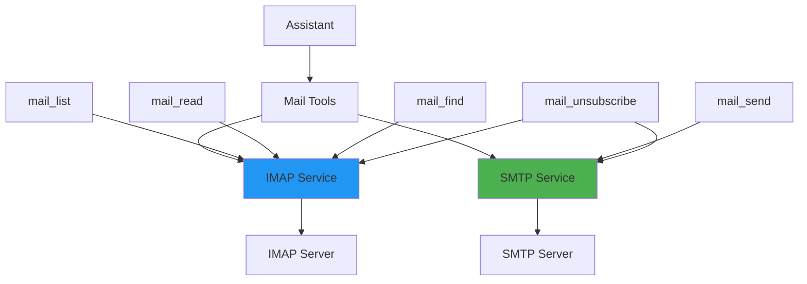

# Mail Reference

This document provides comprehensive information about Kokibot's email integration, including SMTP/IMAP configuration, email tools, and best practices.

## Table of Contents
- [Overview](#overview)
- [Architecture](#architecture)
- [Configuration](#configuration)
- [Email Tools](#email-tools)
- [Setup Guides](#setup-guides)
- [Best Practices](#best-practices)
- [Troubleshooting](#troubleshooting)

---

## Overview

### What is the Mail System?

Kokibot's mail system provides comprehensive email capabilities:
- **Read emails** via IMAP
- **Send emails** via SMTP
- **Search emails** with filters
- **Manage subscriptions** automatically
- **Process email content** (HTML to Markdown conversion)

### Capabilities

| Feature | Description | Tools |
|---------|-------------|-------|
| **Inbox Management** | List and read emails | `mail_list`, `mail_read` |
| **Email Sending** | Send new emails or replies | `mail_send` |
| **Email Search** | Find emails by criteria | `mail_find` |
| **Unsubscribe** | Auto-unsubscribe from lists | `mail_unsubscribe` |

---

## Architecture

### System Components



### IMAP Service

**Purpose:** Read emails from mailbox

**Features:**
- Connect to IMAP servers
- Folder access (INBOX, Sent, etc.)
- Message retrieval
- SSL/TLS support

**Implementation:** `service/mail/IMAP.kt`

### SMTP Service

**Purpose:** Send emails

**Features:**
- Connect to SMTP servers
- Send new emails
- Reply to existing emails
- Authentication support
- SSL/TLS support

**Implementation:** `service/mail/SMTP.kt`

---

## Configuration

### Basic Configuration

Minimum setup in `~/kokibot/config/settings.json`:

```json
{
  "mail": {
    "smtp": {
      "host": "smtp.gmail.com",
      "port": 587,
      "username": "${MAIL_USERNAME}",
      "password": "${MAIL_PASSWORD}",
      "from": "your-email@gmail.com"
    },
    "imap": {
      "host": "imap.gmail.com",
      "port": 993,
      "username": "${MAIL_USERNAME}",
      "password": "${MAIL_PASSWORD}"
    }
  }
}
```

### Complete Configuration

All available options:

```json
{
  "mail": {
    "smtp": {
      "host": "smtp.example.com",
      "port": 587,
      "username": "${MAIL_USERNAME}",
      "password": "${MAIL_PASSWORD}",
      "from": "bot@example.com",
      "use-ssl": false,
      "use-tls": true
    },
    "imap": {
      "host": "imap.example.com",
      "port": 993,
      "username": "${MAIL_USERNAME}",
      "password": "${MAIL_PASSWORD}",
      "use-ssl": true
    }
  }
}
```

### Configuration Parameters

#### SMTP Parameters

| Parameter | Type | Required | Default | Description |
|-----------|------|----------|---------|-------------|
| `host` | string | Yes | - | SMTP server hostname |
| `port` | integer | Yes | - | SMTP server port |
| `username` | string | Yes | - | SMTP username |
| `password` | string | Yes | - | SMTP password |
| `from` | string | Yes | - | Sender email address |
| `use-ssl` | boolean | No | false | Enable SSL |
| `use-tls` | boolean | No | false | Enable TLS/STARTTLS |

#### IMAP Parameters

| Parameter | Type | Required | Default | Description |
|-----------|------|----------|---------|-------------|
| `host` | string | Yes | - | IMAP server hostname |
| `port` | integer | Yes | - | IMAP server port |
| `username` | string | Yes | - | IMAP username |
| `password` | string | Yes | - | IMAP password |
| `use-ssl` | boolean | No | false | Enable SSL |

### Environment Variables

Set credentials via environment variables:

```bash
export MAIL_USERNAME="your-email@example.com"
export MAIL_PASSWORD="your-password"
```

Configuration automatically substitutes variables:
```json
{
  "username": "${MAIL_USERNAME}",
  "password": "${MAIL_PASSWORD}"
}
```

---

## Email Tools

### mail_list

List emails from mailbox.

**Parameters:**
- `folder` (string, optional): Folder name (default: "INBOX")
- `limit` (integer, optional): Max emails to return (default: 10, max: 200)

**Example:**
```
User: Show my recent emails
Assistant: *calls mail_list(limit=10)*

Results:
1. From: john@example.com
   Subject: Meeting Tomorrow
   Date: 2026-04-13
   Message-ID: <abc123@example.com>

2. From: newsletter@news.com
   Subject: Weekly Digest
   Date: 2026-04-12
   Message-ID: <def456@news.com>
```

**Use Cases:**
- Check inbox
- Monitor unread messages
- Email triage

---

### mail_read

Read full email content.

**Parameters:**
- `message_id` (string, required): Email message ID
- `folder` (string, optional): Folder name (default: "INBOX")

**Example:**
```
User: Read the first email
Assistant: *calls mail_read(message_id="<abc123@example.com>")*

Result:
From: john@example.com
To: you@example.com
Subject: Meeting Tomorrow
Date: 2026-04-13 14:30

Hi,

Let's meet tomorrow at 2 PM in the conference room.

Best,
John
```

**Features:**
- HTML to Markdown conversion
- Multipart message handling
- Header extraction
- Unsubscribe link detection

**Use Cases:**
- Read specific emails
- Extract email content
- Analyze email structure

---

### mail_send

Send email or reply to existing email.

**Parameters:**
- `to` (string, required): Recipient email
- `subject` (string, required): Email subject
- `body` (string, required): Email body (supports HTML)
- `reply_to_id` (string, optional): Message ID to reply to

**New Email Example:**
```
User: Send email to john@example.com about the meeting
Assistant: *calls mail_send(
  to="john@example.com",
  subject="Meeting Confirmation",
  body="Hi John, Confirmed for tomorrow at 2 PM."
)*

Result: Email sent successfully to john@example.com
```

**Reply Example:**
```
User: Reply saying "Looking forward to it"
Assistant: *calls mail_send(
  to="john@example.com",
  subject="Re: Meeting Tomorrow",
  body="Looking forward to it.",
  reply_to_id="<abc123@example.com>"
)*

Result: Reply sent successfully
```

**Features:**
- HTML body support
- Reply threading
- Automatic From address
- SMTP authentication

**Use Cases:**
- Automated responses
- Notifications
- Email drafting
- Follow-ups

---

### mail_find

Search emails by criteria.

**Parameters:**
- `from` (string, optional): Sender email filter
- `subject` (string, optional): Subject keyword filter
- `since` (string, optional): Date filter (YYYY-MM-DD)
- `folder` (string, optional): Folder to search (default: "INBOX")
- `limit` (integer, optional): Max results (default: 10, max: 200)

**Find by Sender:**
```
User: Find emails from my boss
Assistant: *calls mail_find(from="boss@company.com", limit=20)*

Found 5 emails:
1. Subject: Q2 Review - Date: 2026-04-13
2. Subject: Budget Approval - Date: 2026-04-10
...
```

**Find by Subject:**
```
User: Find emails about "invoice"
Assistant: *calls mail_find(subject="invoice", since="2026-04-01")*

Found 3 emails:
1. From: billing@vendor.com - Subject: Invoice #1234
...
```

**Combined Search:**
```
User: Find recent emails from support about billing
Assistant: *calls mail_find(
  from="support@company.com",
  subject="billing",
  since="2026-04-07"
)*
```

**Use Cases:**
- Email search
- Finding specific conversations
- Inbox organization
- Email analysis

---

### mail_unsubscribe

Automatically unsubscribe from mailing lists.

**Parameters:**
- `message_id` (string, required): Message ID of email to unsubscribe from

**Example:**
```
User: Unsubscribe from that newsletter
Assistant: *calls mail_read(message_id="<def456@news.com>")* [to get details]
          *calls mail_unsubscribe(message_id="<def456@news.com>")*

Result: Unsubscribe request sent to newsletter@news.com
```

**How It Works:**
1. Reads email headers
2. Finds `List-Unsubscribe` header
3. Extracts unsubscribe URL or mailto address
4. Sends unsubscribe request (HTTP or email)

**Supported Methods:**
- HTTP unsubscribe links
- Mailto unsubscribe addresses

**Use Cases:**
- Inbox cleanup
- Subscription management
- Spam reduction

---

## Setup Guides

### Gmail Setup

#### Prerequisites
- Gmail account
- 2-Factor Authentication enabled

#### Step 1: Enable 2FA

1. Go to [Google Account Security](https://myaccount.google.com/security)
2. Enable 2-Step Verification

#### Step 2: Generate App Password

1. Visit [App Passwords](https://myaccount.google.com/apppasswords)
2. Select "Mail" as the app
3. Select "Other" as the device
4. Enter "Kokibot" as the name
5. Click "Generate"
6. Copy the 16-character password

#### Step 3: Configure Kokibot

```json
{
  "mail": {
    "smtp": {
      "host": "smtp.gmail.com",
      "port": 587,
      "username": "${MAIL_USERNAME}",
      "password": "${MAIL_PASSWORD}",
      "from": "your-email@gmail.com",
      "use-tls": true
    },
    "imap": {
      "host": "imap.gmail.com",
      "port": 993,
      "username": "${MAIL_USERNAME}",
      "password": "${MAIL_PASSWORD}",
      "use-ssl": true
    }
  }
}
```

#### Step 4: Set Environment Variables

```bash
export MAIL_USERNAME="your-email@gmail.com"
export MAIL_PASSWORD="xxxx xxxx xxxx xxxx"  # App password
```

---

### Outlook/Office 365 Setup

#### Configuration

```json
{
  "mail": {
    "smtp": {
      "host": "smtp-mail.outlook.com",
      "port": 587,
      "username": "${MAIL_USERNAME}",
      "password": "${MAIL_PASSWORD}",
      "from": "your-email@outlook.com",
      "use-tls": true
    },
    "imap": {
      "host": "outlook.office365.com",
      "port": 993,
      "username": "${MAIL_USERNAME}",
      "password": "${MAIL_PASSWORD}",
      "use-ssl": true
    }
  }
}
```

#### App Password

For accounts with 2FA:
1. Go to [Microsoft Account Security](https://account.microsoft.com/security)
2. Generate app password
3. Use app password instead of regular password

---

### Custom SMTP/IMAP Server

#### Configuration

```json
{
  "mail": {
    "smtp": {
      "host": "mail.example.com",
      "port": 587,
      "username": "${MAIL_USERNAME}",
      "password": "${MAIL_PASSWORD}",
      "from": "bot@example.com",
      "use-tls": true
    },
    "imap": {
      "host": "mail.example.com",
      "port": 993,
      "username": "${MAIL_USERNAME}",
      "password": "${MAIL_PASSWORD}",
      "use-ssl": true
    }
  }
}
```

#### Common Ports

| Protocol | Port | Encryption |
|----------|------|------------|
| SMTP | 25 | None |
| SMTP | 465 | SSL |
| SMTP | 587 | TLS/STARTTLS |
| IMAP | 143 | None |
| IMAP | 993 | SSL |

---

## Best Practices

### Security

✅ **Do:**
- Use app passwords instead of account passwords
- Enable 2-Factor Authentication
- Store credentials in environment variables
- Use SSL/TLS encryption
- Rotate passwords regularly

❌ **Don't:**
- Commit passwords to version control
- Share email credentials
- Use unencrypted connections
- Use production email in testing
- Store passwords in configuration files

### Performance

**Rate Limiting:**
- Be mindful of provider rate limits
- Implement request throttling
- Use pagination for large results

**Folder Management:**
- Only access needed folders
- Close connections after use
- Reuse connections when possible

**Content Processing:**
- Limit email body length
- Strip unnecessary HTML
- Cache processed content

### Email Etiquette

**Automated Emails:**
- Clearly identify as automated
- Include unsubscribe mechanism
- Respect user preferences
- Avoid spam triggers

**Reply Management:**
- Maintain proper threading
- Quote relevant context
- Use clear subject lines
- Preserve email headers

---

## Monitoring

### Health Checks

Check email system status:

```
/health
```

Response includes SMTP and IMAP status:
```json
{
  "smtp": {
    "status": "ok",
    "host": "smtp.gmail.com"
  },
  "imap": {
    "status": "ok",
    "host": "imap.gmail.com"
  }
}
```

### Logs

Monitor email operations in logs:

```
[INFO] SMTP: Connected to smtp.gmail.com:587
[INFO] IMAP: Connected to imap.gmail.com:993
[INFO] Mail sent to: john@example.com
```

---

## Troubleshooting

### Authentication Failures

**Problem: Invalid Credentials**
```
ERROR: Authentication failed - Username and Password not accepted
```

**Solutions:**
1. **Gmail:** Use app password, not account password
2. Verify 2FA is enabled
3. Check username/password are correct
4. Test credentials manually:
   ```bash
   telnet smtp.gmail.com 587
   ```

---

### Connection Issues

**Problem: Connection Timeout**
```
ERROR: Connection timed out to imap.gmail.com:993
```

**Solutions:**
1. Check firewall allows outbound connections
2. Verify ports 587 (SMTP) and 993 (IMAP) are open
3. Test connectivity:
   ```bash
   telnet imap.gmail.com 993
   telnet smtp.gmail.com 587
   ```
4. Check server status
5. Try alternative ports

---

### SSL/TLS Errors

**Problem: SSL Handshake Failed**
```
ERROR: SSL handshake failed
```

**Solutions:**
1. Verify SSL/TLS settings:
   ```json
   {
     "smtp": { "use-tls": true },
     "imap": { "use-ssl": true }
   }
   ```
2. Update Java security certificates
3. Check server certificate validity

---

### Send Failures

**Problem: Failed to Send Email**
```
ERROR: Failed to send email to john@example.com
```

**Solutions:**
1. Verify SMTP configuration
2. Check "from" address is valid
3. Ensure SMTP authentication is working
4. Check recipient address is valid
5. Review email content for spam triggers
6. Check rate limits

---

### IMAP Folder Access

**Problem: Folder Not Found**
```
ERROR: Folder "Sent" not found
```

**Solutions:**
1. List available folders first
2. Use correct folder names (case-sensitive)
3. Some providers use different names:
   - Gmail: "[Gmail]/Sent Mail"
   - Others: "Sent Items", "Sent", "Sent Mail"

---

## Advanced Topics

### Custom Email Folders

Access non-INBOX folders:

```kotlin
// In custom tools or skills
val folder = store.getFolder("Sent")
folder.open(Folder.READ_ONLY)
val messages = folder.messages
```

### Email Parsing

**HTML to Markdown:**
```kotlin
val markdown = HtmlUtil.toMarkdown(htmlContent)
```

**Extract Plain Text:**
```kotlin
val text = when {
    message.isMimeType("text/plain") -> message.content as String
    message.isMimeType("text/html") -> {
        val html = message.content as String
        HtmlUtil.toMarkdown(html)
    }
    else -> ""
}
```

### Attachment Handling

**Future Enhancement:**
Currently, Kokibot focuses on text content. Attachment support is planned:

🔄 **Planned Features:**
- Attachment detection
- Download attachments
- Process common formats (PDF, images)
- Send emails with attachments

---

## Email Automation Examples

### Auto-Responder

Create a skill that auto-responds to emails:

```markdown
## Tools

- `auto_respond`: Automatically respond to emails matching criteria
    - `from_filter`: (string) Sender filter
    - `response`: (string) Response template

## Instructions

When user enables auto-responder:
1. Use `mail_find` to find matching emails
2. For each email, check if already responded
3. Use `mail_send` with `reply_to_id` to respond
4. Mark as processed
```

### Email Digest

Summarize daily emails:

```markdown
## Tools

- `generate_digest`: Create email summary
    - `since`: (string) Date to start from
    - `categories`: (array) Categories to include

## Instructions

Daily digest process:
1. Use `mail_find` with `since` parameter
2. Categorize emails (important, newsletters, etc.)
3. Summarize key emails
4. Present digest to user
```

### Inbox Zero Helper

Assist with inbox management:

```markdown
## Tools

- `inbox_triage`: Help categorize and process emails
    - `limit`: (int) Number of emails to process

## Instructions

Inbox triage workflow:
1. Use `mail_list` to get unread emails
2. For each email, suggest action (respond, archive, delete)
3. For newsletters, offer unsubscribe option
4. Draft responses for important emails
```

---

## See Also

- [Tools Reference](tools.md) - Email tool details
- [Setup Guide](../SETUP.md) - Complete installation
- [Architecture](../ARCHITECTURE.md) - Mail system design
- [Commands Reference](commands.md) - System commands

---

[← LLM Reference](llm.md) | [Heartbeat Reference →](heartbeat.md)
