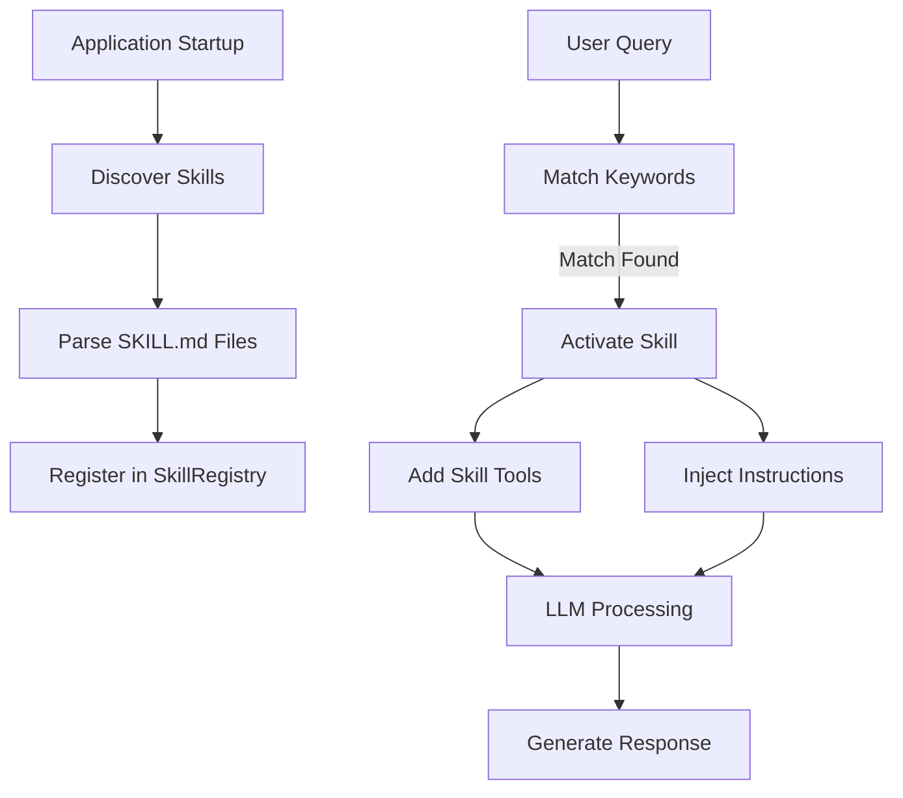

# Skills Reference

Skills are modular extensions that dynamically activate based on user intent. They provide domain-specific capabilities through custom tools and specialized instructions.

## Table of Contents
- [Overview](#overview)
- [How Skills Work](#how-skills-work)
- [Creating Skills](#creating-skills)
- [Skill Structure](#skill-structure)
- [Examples](#examples)
- [Best Practices](#best-practices)

---

## Overview

### What are Skills?

Skills are self-contained modules that:
- **Automatically activate** based on keywords in user queries
- **Provide specialized tools** for domain-specific tasks
- **Include instructions** that guide the assistant's behavior
- **Define requirements** for binaries and environment variables

### Skills vs Tools vs Commands

| Feature | Skills | Tools | Commands |
|---------|--------|-------|----------|
| **Activation** | Automatic (keywords) | LLM decides | Manual (`/command`) |
| **Scope** | Domain-specific | General capabilities | System-level |
| **Components** | Tools + Instructions | Single function | Direct execution |
| **Location** | `~/kokibot/skills/` | Built-in | Built-in |

---

## How Skills Work

### Skill Lifecycle



### Activation Process

1. **User sends query:** "Check property ownership for 123 Main St"
2. **Skill matcher** scans for keywords: "property", "ownership"
3. **Matching skills activated:** `land-title-verifier` skill
4. **Skill tools added** to available tools for this request
5. **Skill instructions** injected into system prompt
6. **LLM processes** query with enhanced capabilities

---

## Creating Skills

### Quick Start

Create a new skill in 3 steps:

#### Step 1: Create Skill Directory

```bash
mkdir -p ~/kokibot/skills/my-skill
```

#### Step 2: Create SKILL.md

```bash
cat > ~/kokibot/skills/my-skill/SKILL.md << 'EOF'
---
name: my-skill
description: Brief description of your skill
requires:
    bins: []
    env: []
metadata:
    keywords: ["keyword1", "keyword2"]
    categories: ["category"]
---

# My Skill

Detailed description of what this skill does.

## Tools

- `my_tool`: Tool description
    - `param1`: (string) Parameter description
    - `param2`: (int) Optional parameter

## Instructions

Guidelines for the assistant on how to use this skill effectively.

## Examples

User: "Example query that triggers this skill"
Action: Call `my_tool(param1="value")`
EOF
```

#### Step 3: Restart Kokibot

```bash
mvn spring-boot:run
```

The skill will be automatically discovered and made available.

---

## Skill Structure

### SKILL.md Format

A skill is defined by a single `SKILL.md` file with three sections:

1. **YAML Frontmatter** - Metadata and configuration
2. **Markdown Body** - Description and documentation
3. **Tool Definitions** - Custom tools with parameters

### Complete Example

```markdown
---
name: weather-assistant
description: Provides weather information and forecasts
requires:
    bins: ["curl"]
    env: ["WEATHER_API_KEY"]
metadata:
    keywords: ["weather", "temperature", "forecast", "climate"]
    categories: ["information", "weather"]
---

# Weather Assistant

This skill provides current weather information and forecasts for any location.

## Tools

- `get_weather`: Get current weather for a location
    - `location`: (string) City name or zip code
    - `units`: (string) Temperature units - "fahrenheit" or "celsius" (default: "fahrenheit")

- `get_forecast`: Get weather forecast for upcoming days
    - `location`: (string) City name or zip code
    - `days`: (int) Number of days to forecast (1-7, default: 3)

## Instructions

When users ask about weather:
1. Determine the location from the query
2. Use `get_weather` for current conditions
3. Use `get_forecast` for future weather
4. Always include temperature, conditions, and humidity
5. Warn about severe weather conditions

## Examples

User: "What's the weather like in San Francisco?"
Action: Call `get_weather(location="San Francisco")`

User: "Will it rain in Seattle this week?"
Action: Call `get_forecast(location="Seattle", days=7)`
```

---

## Frontmatter Reference

### Required Fields

| Field | Type | Description |
|-------|------|-------------|
| `name` | string | Unique skill identifier (lowercase, hyphens) |
| `description` | string | Brief description (1-2 sentences) |
| `requires.bins` | array | Required system binaries |
| `requires.env` | array | Required environment variables |
| `metadata.keywords` | array | Activation keywords |
| `metadata.categories` | array | Skill categories for organization |

### Field Details

#### `name`
- **Format:** lowercase with hyphens
- **Example:** `property-search`, `email-analyzer`
- **Must be unique** across all skills

#### `description`
- **Length:** 1-2 sentences
- **Purpose:** Shows in skill list, helps LLM understand when to activate
- **Example:** "Search and analyze property records and ownership history"

#### `requires.bins`
- **Type:** Array of strings
- **Purpose:** System binaries that must be available
- **Examples:** `["python3", "curl", "jq"]`
- **Validation:** Kokibot checks these exist at startup

#### `requires.env`
- **Type:** Array of strings
- **Purpose:** Environment variables that must be set
- **Examples:** `["API_KEY", "DATABASE_URL"]`
- **Validation:** Kokibot checks these exist at startup

#### `metadata.keywords`
- **Type:** Array of strings
- **Purpose:** Trigger words for automatic activation
- **Examples:** `["property", "title", "deed", "ownership"]`
- **Matching:** Case-insensitive substring matching

#### `metadata.categories`
- **Type:** Array of strings
- **Purpose:** Organize skills by domain
- **Examples:** `["real-estate", "legal", "research"]`

---

## Tool Definitions

### Syntax

Tools are defined in the `## Tools` section using this format:

```markdown
## Tools

- `tool_name`: Tool description
    - `param1`: (type) Parameter description
    - `param2`: (type) Optional parameter (default: value)
```

### Parameter Types

| Type | Description | Example |
|------|-------------|---------|
| `string` | Text value | "hello" |
| `int` | Integer number | 42 |
| `float` | Decimal number | 3.14 |
| `bool` | Boolean | true/false |
| `array` | List of values | ["a", "b", "c"] |
| `object` | Key-value pairs | {"key": "value"} |

### Tool Examples

**Simple tool:**
```markdown
- `get_time`: Get current time
```

**Tool with required parameter:**
```markdown
- `search_user`: Search for user by email
    - `email`: (string) User email address
```

**Tool with optional parameters:**
```markdown
- `fetch_data`: Fetch data from API
    - `endpoint`: (string) API endpoint path
    - `limit`: (int) Max results (default: 10)
    - `format`: (string) Response format - "json" or "xml" (default: "json")
```

**Tool with complex parameters:**
```markdown
- `create_record`: Create new record
    - `data`: (object) Record data with name, email, and address
    - `tags`: (array) List of tag strings
    - `notify`: (bool) Send notification (default: false)
```

---

## Implementing Tool Logic

### Using Scripts

Skills can include executable scripts for tool implementations:

**Directory Structure:**
```
~/kokibot/skills/my-skill/
├── SKILL.md
└── scripts/
    ├── my_tool.py
    ├── another_tool.sh
    └── helper.js
```

**Python Example (`scripts/get_weather.py`):**
```python
#!/usr/bin/env python3
import sys
import json
import os
import requests

def get_weather(location):
    api_key = os.environ.get('WEATHER_API_KEY')
    url = f"https://api.weather.com/v1/current?location={location}&key={api_key}"
    
    response = requests.get(url)
    data = response.json()
    
    return {
        "temperature": data["temp"],
        "conditions": data["conditions"],
        "humidity": data["humidity"]
    }

if __name__ == "__main__":
    args = json.loads(sys.argv[1])
    result = get_weather(args["location"])
    print(json.dumps(result))
```

**Shell Example (`scripts/check_disk.sh`):**
```bash
#!/bin/bash
df -h | grep -v "Filesystem" | awk '{print $5 " " $6}'
```

### Calling Scripts from Tools

The assistant can execute scripts using the `shell` or `python` built-in tools:

```
User: What's the weather in Boston?
Assistant: *activated weather-assistant skill*
          *calls shell(command="python3 ~/kokibot/skills/weather-assistant/scripts/get_weather.py '{\"location\":\"Boston\"}'")
```

---

## Instructions Section

The `## Instructions` section provides guidelines for how the assistant should use the skill.

### Good Instructions

```markdown
## Instructions

### When to Use
Activate this skill when users ask about:
- Current weather conditions
- Weather forecasts
- Climate information
- Temperature queries

### How to Use
1. Extract location from user query
2. Determine if current weather or forecast is needed
3. Use appropriate tool with correct parameters
4. Format response in user-friendly way
5. Include units (F or C) based on user preference

### Best Practices
- Always confirm location if ambiguous
- Warn about severe weather
- Provide time context (e.g., "as of 2:30 PM")
- Convert units if user specifies preference

### Error Handling
- If location not found, ask for clarification
- If API fails, notify user and suggest retry
```

### Instructions Checklist

✅ **When to activate the skill**
✅ **Step-by-step usage guide**
✅ **Expected behavior and style**
✅ **Error handling strategies**
✅ **Edge cases and special scenarios**

---

## Examples Section

The `## Examples` section demonstrates typical usage patterns.

### Format

```markdown
## Examples

User: "User query example"
Action: What the assistant should do
Result: Expected outcome

User: "Another example"
Action: Tool call with parameters
```

### Example Collection

```markdown
## Examples

User: "What's the weather in Tokyo?"
Action: Call `get_weather(location="Tokyo", units="celsius")`
Result: Display current temperature, conditions, and humidity

User: "Will it be sunny this weekend in Miami?"
Action: Call `get_forecast(location="Miami", days=3)`
Result: Show forecast for next 3 days focusing on conditions

User: "How cold is it outside?"
Action: If location unknown, ask "Where are you located?"
Result: Get location, then call `get_weather(location=<location>)`

User: "Compare weather in NYC and LA"
Action: Call `get_weather(location="New York City")` and `get_weather(location="Los Angeles")`
Result: Display both results side by side
```

---

## Complete Skill Examples

### Example 1: Email Analyzer

```markdown
---
name: email-analyzer
description: Analyze emails for sentiment, urgency, and key information
requires:
    bins: ["python3"]
    env: ["MAIL_USERNAME", "MAIL_PASSWORD"]
metadata:
    keywords: ["analyze", "email", "sentiment", "urgent", "priority"]
    categories: ["email", "analysis"]
---

# Email Analyzer

Analyzes emails to extract sentiment, urgency level, and key action items.

## Tools

- `analyze_email`: Analyze an email's content
    - `message_id`: (string) Email message ID
    - `aspects`: (array) Aspects to analyze - ["sentiment", "urgency", "actions"] (default: all)

- `prioritize_inbox`: Analyze and prioritize recent emails
    - `count`: (int) Number of emails to analyze (default: 10)
    - `folder`: (string) Folder to analyze (default: "INBOX")

## Instructions

When analyzing emails:
1. Use `mail_read` to fetch email content if needed
2. Call `analyze_email` with message ID
3. Report sentiment (positive/neutral/negative)
4. Indicate urgency level (low/medium/high)
5. Extract action items and deadlines
6. Suggest priority order for responses

For inbox prioritization:
1. Use `prioritize_inbox` to analyze multiple emails
2. Sort by urgency and importance
3. Highlight time-sensitive items
4. Suggest which emails to respond to first

## Examples

User: "Analyze my latest email"
Action: 
1. Call `mail_list(limit=1)` to get latest email
2. Call `analyze_email(message_id=<id>)` to analyze it

User: "Which emails should I respond to first?"
Action: Call `prioritize_inbox(count=20)` to get prioritized list
```

### Example 2: Property Search

```markdown
---
name: property-search
description: Search property records, ownership, and title history
requires:
    bins: []
    env: ["PROPERTY_API_KEY"]
metadata:
    keywords: ["property", "real estate", "title", "deed", "ownership", "address"]
    categories: ["real-estate", "legal"]
---

# Property Search

Search and retrieve property records, ownership information, and title history.

## Tools

- `search_property`: Search for property by address
    - `address`: (string) Property address
    - `city`: (string) City name
    - `state`: (string) State abbreviation
    - `zip`: (string) ZIP code (optional)

- `get_ownership`: Get current ownership information
    - `property_id`: (string) Property ID from search results
    
- `get_title_history`: Get property title history
    - `property_id`: (string) Property ID from search results
    - `years`: (int) Number of years back (default: 10)

## Instructions

### Property Search Flow
1. Extract address components from user query
2. Use `search_property` to find property
3. If multiple results, ask user to clarify
4. Once property identified, can get ownership or title history

### Presenting Results
- Format addresses consistently
- Show current owner with contact info if available
- For title history, show chronologically
- Highlight any liens or encumbrances
- Flag any title issues or gaps

### Privacy & Ethics
- Only provide public record information
- Respect privacy laws and regulations
- Inform user this is public data only
- Suggest consulting attorney for legal questions

## Examples

User: "Who owns 123 Main Street in Springfield?"
Action:
1. Call `search_property(address="123 Main Street", city="Springfield")`
2. Get property_id from results
3. Call `get_ownership(property_id=<id>)`

User: "Show me the title history for that property"
Action: Call `get_title_history(property_id=<id>, years=20)`

User: "Search for properties at 456 Oak Avenue"
Action: Call `search_property(address="456 Oak Avenue")`
Result: May return multiple results if city/state not specified, ask user to clarify
```

### Example 3: Code Reviewer

```markdown
---
name: code-reviewer
description: Review code for best practices, bugs, and improvements
requires:
    bins: ["git"]
    env: []
metadata:
    keywords: ["review", "code", "analyze", "refactor", "improve", "bugs"]
    categories: ["development", "quality"]
---

# Code Reviewer

Analyzes code for best practices, potential bugs, and improvement opportunities.

## Tools

- `review_code`: Review code snippet or file
    - `code`: (string) Code to review
    - `language`: (string) Programming language
    - `focus`: (array) Review focus - ["bugs", "style", "performance", "security"] (default: all)

- `suggest_refactoring`: Suggest refactoring improvements
    - `code`: (string) Code to refactor
    - `language`: (string) Programming language
    - `goal`: (string) Refactoring goal - "readability", "performance", or "maintainability"

## Instructions

### Code Review Process
1. Read and understand the code
2. Check for syntax and logical errors
3. Evaluate against best practices for the language
4. Look for performance issues
5. Check for security vulnerabilities
6. Suggest improvements with examples

### Review Format
- Start with overall assessment
- List issues by severity (critical, major, minor)
- Provide specific line references
- Show before/after examples for suggestions
- Explain *why* each change improves the code

### Security Focus
- SQL injection vulnerabilities
- XSS vulnerabilities
- Authentication/authorization issues
- Sensitive data exposure
- Input validation

### Performance Focus
- O(n²) algorithms that could be O(n)
- Unnecessary loops or operations
- Memory leaks
- Inefficient data structures

## Examples

User: "Review this Python function: [code]"
Action: Call `review_code(code="[code]", language="python", focus=["bugs", "style"])`

User: "How can I make this code more readable?"
Action: Call `suggest_refactoring(code="[code]", language="java", goal="readability")`
```

---

## Testing Skills

### Manual Testing

**Step 1: Check skill is discovered**
```
/skill my-skill
```

**Step 2: Verify activation keywords**
```
User: Use one of the keywords from your skill
```

**Step 3: Test tool execution**
```
User: Ask the assistant to use the skill's tools
```

### Debugging Skills

**Check discovery:**
```bash
ls ~/kokibot/skills/*/SKILL.md
```

**Validate SKILL.md format:**
```bash
# Check YAML frontmatter
head -n 20 ~/kokibot/skills/my-skill/SKILL.md
```

**Check activation logs:**
Look for skill activation in application logs:
```
[INFO] Activated skills: [my-skill]
[INFO] Added tools: [my_tool]
```

---

## Best Practices

### Skill Design

✅ **Do:**
- Focus on a specific domain or use case
- Use clear, descriptive keywords
- Provide detailed instructions
- Include multiple examples
- Document all parameters
- Handle errors gracefully

❌ **Don't:**
- Create overlapping skills (consolidate instead)
- Use overly generic keywords
- Assume prior knowledge
- Skip error handling
- Make tools too complex

### Keywords Selection

**Good Keywords:**
- Specific to the domain: `["property", "deed", "title"]`
- Action-oriented: `["analyze", "search", "verify"]`
- Natural language: `["weather", "forecast", "temperature"]`

**Bad Keywords:**
- Too generic: `["help", "show", "get"]`
- Too narrow: `["get_weather_for_boston"]`
- Rare terms: `["meteorological"]`

### Tool Design

✅ **Single Responsibility**
```markdown
- `get_weather`: Get current weather
- `get_forecast`: Get weather forecast
```

❌ **Multiple Responsibilities**
```markdown
- `weather_tool`: Does everything weather-related
```

✅ **Clear Parameters**
```markdown
- `search`: Search for items
    - `query`: (string) Search query
    - `limit`: (int) Max results (default: 10)
```

❌ **Unclear Parameters**
```markdown
- `search`: Search
    - `params`: (object) All the params
```

### Instructions Quality

**Good Instructions:**
```markdown
## Instructions

1. Extract location from user query
2. If location is ambiguous, ask for clarification
3. Call appropriate tool with validated parameters
4. Format response with units and context
5. Handle errors by explaining issue and suggesting alternatives
```

**Bad Instructions:**
```markdown
## Instructions

Use the tools to get weather data.
```

---

## Skill Configuration

### Environment Variables

Skills can require environment variables:

```yaml
requires:
    env: ["API_KEY", "DATABASE_URL"]
```

**Setting Environment Variables:**
```bash
export API_KEY="your-key"
export DATABASE_URL="postgresql://localhost/db"
```

**Using in Scripts:**
```python
import os
api_key = os.environ.get('API_KEY')
```

### Binary Requirements

Skills can require system binaries:

```yaml
requires:
    bins: ["python3", "curl", "jq"]
```

**Verification:**
Kokibot checks these exist at startup:
```
[INFO] Checking skill requirements for my-skill
[INFO] ✓ python3 found at /usr/bin/python3
[INFO] ✓ curl found at /usr/bin/curl
[INFO] ✓ jq found at /usr/local/bin/jq
```

**Installing Binaries:**
```bash
# macOS
brew install python3 curl jq

# Ubuntu
sudo apt install python3 curl jq
```

---

## Troubleshooting

### Skill Not Discovered

**Problem:** Skill doesn't appear in `/skill` list

**Solution:**
1. Check file location: `~/kokibot/skills/my-skill/SKILL.md`
2. Verify YAML frontmatter is valid
3. Restart Kokibot
4. Check logs for parsing errors

### Skill Not Activating

**Problem:** Skill exists but doesn't activate

**Solution:**
1. Check keywords match user query
2. Keywords are case-insensitive but must be exact
3. Try `/skill my-skill` to see skill details
4. Test with explicit keyword usage

### Tool Execution Fails

**Problem:** Skill activates but tool fails

**Solution:**
1. Check required binaries exist: `which python3`
2. Verify environment variables: `echo $API_KEY`
3. Test script directly: `python3 script.py '{"arg":"value"}'`
4. Check script permissions: `chmod +x script.sh`

### Invalid SKILL.md Format

**Problem:** Parsing error during discovery

**Solution:**
1. Validate YAML frontmatter (must start with `---`)
2. Check indentation (use spaces, not tabs)
3. Verify required fields present
4. Test YAML online: https://www.yamllint.com/

---

## Advanced Topics

### Skill Dependencies

Skills can depend on built-in tools:

```markdown
## Instructions

This skill uses the following built-in tools:
- `mail_read`: To fetch email content
- `python`: To execute analysis scripts

Usage:
1. Call `mail_read(message_id=<id>)` to get email
2. Call `python(code=<analysis_script>)` to analyze
3. Call skill tool `generate_report` with results
```

### Skill Composition

Skills can work together:

```markdown
## Instructions

This skill complements the email-analyzer skill:
- First, use email-analyzer to identify priority emails
- Then, use this skill to draft responses
- Finally, use mail_send to send responses
```

### Dynamic Tool Parameters

Tools can have context-dependent parameters:

```markdown
- `search`: Search for items
    - `query`: (string) Search query
    - `filters`: (object) Optional filters based on item type:
        - For products: {"category", "price_range"}
        - For users: {"role", "status"}
        - For documents: {"date_range", "author"}
```

---

## Skill Ecosystem

### Skill Categories

Organize skills by category:

| Category | Examples |
|----------|----------|
| **Communication** | email-analyzer, slack-responder |
| **Development** | code-reviewer, git-helper |
| **Data** | csv-analyzer, database-query |
| **Research** | paper-search, fact-checker |
| **Finance** | expense-tracker, invoice-processor |
| **Real Estate** | property-search, market-analyzer |
| **Legal** | document-reviewer, compliance-checker |

### Sharing Skills

Skills are portable and can be shared:

**Export a Skill:**
```bash
tar -czf my-skill.tar.gz -C ~/kokibot/skills my-skill
```

**Import a Skill:**
```bash
tar -xzf my-skill.tar.gz -C ~/kokibot/skills
# Restart Kokibot
```

**Skill Repository (Future):**
Community skill repository for easy discovery and installation.

---

## See Also

- [Commands Reference](commands.md) - System commands
- [Tools Reference](tools.md) - Built-in tools
- [Architecture](../ARCHITECTURE.md) - Skill system architecture
- [AGENT.md](../../AGENT.md) - Developer guide

---

[← Tools Reference](tools.md) | [Back to Documentation](../README.md)
