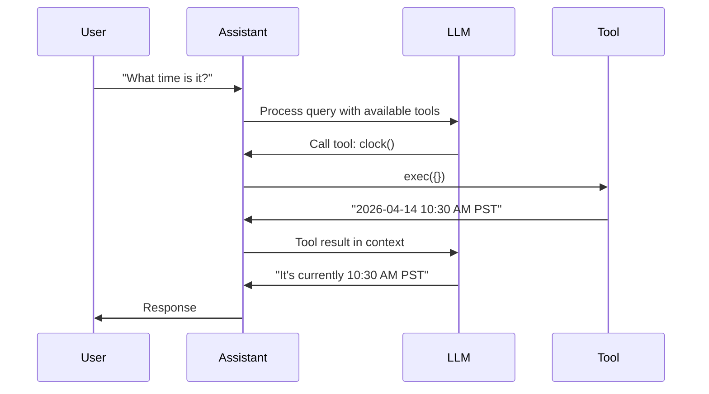

# Tools Reference

Tools extend Kokibot's capabilities by providing interfaces to external systems, APIs, and functionality. This reference documents all built-in tools and how to create custom tools.

## Table of Contents
- [Overview](#overview)
- [Built-in Tools](#built-in-tools)
- [Creating Custom Tools](#creating-custom-tools)
- [Tool Configuration](#tool-configuration)

---

## Overview

### What are Tools?

Tools are executable functions that:
- Extend the assistant's capabilities beyond text generation
- Interface with external systems and APIs
- Execute code in sandboxed environments
- Return structured results to the LLM

### How Tools Work



### Tool Metadata

Each tool defines:
- **Name** - Unique identifier for the tool
- **Description** - What the tool does (used by LLM to decide when to use it)
- **Parameters** - Input parameters with types and descriptions
- **Configuration** - Optional external configuration

---

## Built-in Tools

### Time & Date

#### `clock`

Get the current date and time in human-readable format.

**Parameters:** None

**Returns:** Current date and time with timezone

**Example Usage:**
```
User: What's the current date?
Assistant: *calls clock()*
Result: Monday, April 14, 2026 10:30:45 AM PDT
```

**Implementation:** `ClockTool.kt`

**Configuration:** None required

**Use Cases:**
- Time-based reasoning
- Scheduling and reminders
- Date calculations

---

### Web Tools

#### `web_search`

Search the web using Brave Search API.

**Parameters:**
| Name | Type | Required | Description |
|------|------|----------|-------------|
| `query` | string | Yes | Search query |
| `count` | integer | No | Number of results (default: 5, max: 20) |

**Returns:** List of search results with titles, snippets, and URLs

**Example Usage:**
```
User: Search for latest Kotlin news
Assistant: *calls web_search(query="latest Kotlin news", count=5)*
Result:
1. Kotlin 2.2.0 Released - New features include...
   https://kotlinlang.org/docs/whatsnew22.html
2. ...
```

**Configuration:**
Create `~/kokibot/config/tools/web_search.json`:
```json
{
  "api-key": "${BRAVE_SEARCH_API_KEY}"
}
```

**Environment Variables:**
- `BRAVE_SEARCH_API_KEY` - Brave Search API key

**API Key:** Get from [Brave Search API](https://brave.com/search/api/)

**Implementation:** `WebSearchTool.kt`

**Use Cases:**
- Real-time information lookup
- Research and fact-checking
- News and current events

---

#### `web_fetch`

Fetch and extract content from URLs (HTML and PDF supported).

**Parameters:**
| Name | Type | Required | Description |
|------|------|----------|-------------|
| `url` | string | Yes | URL to fetch |

**Returns:** Extracted text content from the URL

**Supported Formats:**
- HTML pages (cleaned and formatted)
- PDF documents (text extraction)

**Example Usage:**
```
User: Summarize https://example.com/article
Assistant: *calls web_fetch(url="https://example.com/article")*
Result: [Extracted article text]
Assistant: The article discusses...
```

**Features:**
- HTML sanitization and cleanup
- PDF text extraction via Apache PDFBox
- Automatic format detection
- Link extraction

**Implementation:** `WebFetchTool.kt`

**Configuration:** None required

**Use Cases:**
- Article summarization
- Documentation reading
- Content extraction
- Research automation

---

### Email Tools

#### `mail_list`

List emails from mailbox using IMAP.

**Parameters:**
| Name | Type | Required | Description |
|------|------|----------|-------------|
| `folder` | string | No | Folder name (default: "INBOX") |
| `limit` | integer | No | Max emails to return (default: 10) |

**Returns:** List of emails with ID, from, subject, date

**Example Usage:**
```
User: Show my recent emails
Assistant: *calls mail_list(folder="INBOX", limit=10)*
Result:
1. [ID: 12345] From: john@example.com
   Subject: Meeting Tomorrow
   Date: 2026-04-13
...
```

**Configuration Required:**
```json
{
  "mail": {
    "imap": {
      "host": "imap.gmail.com",
      "port": 993,
      "username": "${MAIL_USERNAME}",
      "password": "${MAIL_PASSWORD}"
    }
  }
}
```

**Environment Variables:**
- `MAIL_USERNAME` - Email address
- `MAIL_PASSWORD` - Email password or app password

**Implementation:** `MailListTool.kt`

**Use Cases:**
- Inbox monitoring
- Email triage
- Unread message checking

---

#### `mail_read`

Read the full content of an email by message ID.

**Parameters:**
| Name | Type | Required | Description |
|------|------|----------|-------------|
| `message_id` | string | Yes | Email message ID from mail_list |
| `folder` | string | No | Folder name (default: "INBOX") |

**Returns:** Full email content including headers and body

**Example Usage:**
```
User: Read email 12345
Assistant: *calls mail_read(message_id="12345")*
Result:
From: john@example.com
To: you@example.com
Subject: Meeting Tomorrow
Date: 2026-04-13 14:30

Hi,

Let's meet tomorrow at 2 PM...
```

**Configuration:** Same as `mail_list` (IMAP required)

**Implementation:** `MailReadTool.kt`

**Use Cases:**
- Read specific emails
- Extract email content
- Email analysis

---

#### `mail_send`

Send email or reply to an existing email via SMTP.

**Parameters:**
| Name | Type | Required | Description |
|------|------|----------|-------------|
| `to` | string | Yes | Recipient email address |
| `subject` | string | Yes | Email subject |
| `body` | string | Yes | Email body (supports HTML) |
| `reply_to_id` | string | No | Message ID to reply to |

**Returns:** Confirmation message

**Example Usage:**
```
User: Send email to john@example.com about the meeting
Assistant: *calls mail_send(
  to="john@example.com",
  subject="Meeting Confirmation",
  body="Hi John, Confirmed for tomorrow at 2 PM."
)*
Result: Email sent successfully to john@example.com
```

**Reply Example:**
```
User: Reply to that email saying "Looking forward to it"
Assistant: *calls mail_send(
  to="john@example.com",
  subject="Re: Meeting Confirmation",
  body="Looking forward to it.",
  reply_to_id="12345"
)*
```

**Configuration Required:**
```json
{
  "mail": {
    "smtp": {
      "host": "smtp.gmail.com",
      "port": 587,
      "username": "${MAIL_USERNAME}",
      "password": "${MAIL_PASSWORD}",
      "from": "your-email@gmail.com"
    }
  }
}
```

**Environment Variables:**
- `MAIL_USERNAME` - Email address
- `MAIL_PASSWORD` - Email password or app password

**Implementation:** `MailSendTool.kt`

**Use Cases:**
- Automated email responses
- Notifications
- Email scheduling
- Follow-ups

---

#### `mail_find`

Search emails by criteria (from, subject, date range).

**Parameters:**
| Name | Type | Required | Description |
|------|------|----------|-------------|
| `from` | string | No | Filter by sender email |
| `subject` | string | No | Filter by subject keywords |
| `since` | string | No | Date filter (YYYY-MM-DD) |
| `folder` | string | No | Folder to search (default: "INBOX") |
| `limit` | integer | No | Max results (default: 10) |

**Returns:** List of matching emails

**Example Usage:**
```
User: Find emails from my boss this week
Assistant: *calls mail_find(
  from="boss@company.com",
  since="2026-04-07",
  limit=20
)*
Result:
Found 5 emails:
1. [ID: 12345] Subject: Q2 Review
2. [ID: 12346] Subject: Budget Approval
...
```

**Advanced Search:**
```
User: Find emails about "invoice" in the last month
Assistant: *calls mail_find(
  subject="invoice",
  since="2026-03-14"
)*
```

**Configuration:** Same as `mail_list` (IMAP required)

**Implementation:** `MailFindTool.kt`

**Use Cases:**
- Email search
- Finding specific conversations
- Inbox organization
- Email analytics

---

#### `mail_unsubscribe`

Automatically unsubscribe from mailing lists using List-Unsubscribe header.

**Parameters:**
| Name | Type | Required | Description |
|------|------|----------|-------------|
| `message_id` | string | Yes | Message ID of email to unsubscribe from |

**Returns:** Unsubscribe confirmation or instructions

**Example Usage:**
```
User: Unsubscribe from that newsletter (message 12345)
Assistant: *calls mail_unsubscribe(message_id="12345")*
Result: Unsubscribe request sent via mailto:unsubscribe@newsletter.com
```

**How It Works:**
1. Reads email headers
2. Finds `List-Unsubscribe` header
3. Processes unsubscribe link (HTTP or mailto)
4. Sends unsubscribe request

**Configuration:** Requires both IMAP and SMTP configuration

**Implementation:** `MailUnsubscribeTool.kt`

**Use Cases:**
- Inbox cleanup
- Unsubscribe automation
- Spam management

---

### Code Execution

#### `python`

Execute Python code in a sandboxed GraalVM environment.

**Parameters:**
| Name | Type | Required | Description |
|------|------|----------|-------------|
| `code` | string | Yes | Python code to execute |

**Returns:** Execution result or error message

**Example Usage:**
```
User: Calculate fibonacci(100)
Assistant: *calls python(code="
def fib(n):
    a, b = 0, 1
    for _ in range(n):
        a, b = b, a + b
    return a

print(fib(100))
")*
Result: 354224848179261915075
```

**Features:**
- Sandboxed execution via GraalVM
- Standard Python libraries available
- No file system access
- Execution timeout protection

**Limitations:**
- No external library imports
- No network access
- Limited to GraalVM Python capabilities

**Configuration:** None required (GraalVM must be installed)

**Implementation:** `PythonTool.kt`

**Security:**
- Runs in isolated context
- No access to host file system
- Cannot execute system commands

**Use Cases:**
- Mathematical calculations
- Data processing
- Algorithm implementation
- Quick prototyping

---

#### `shell`

Execute shell commands with safety restrictions.

**Parameters:**
| Name | Type | Required | Description |
|------|------|----------|-------------|
| `command` | string | Yes | Shell command to execute |
| `timeout` | integer | No | Timeout in milliseconds (default: 5000) |

**Returns:** Command output (stdout + stderr)

**Example Usage:**
```
User: List files in current directory
Assistant: *calls shell(command="ls -la")*
Result:
total 48
drwxr-xr-x  12 user  staff   384 Apr 14 10:30 .
drwxr-xr-x   8 user  staff   256 Apr 14 09:15 ..
-rw-r--r--   1 user  staff  1234 Apr 14 10:25 README.md
...
```

**Security Restrictions:**

**Blocked Commands:**
- `sudo`, `su` - Privilege escalation
- `rm -rf` - Dangerous deletion
- `chmod`, `chown` - Permission changes
- `> /etc/` - System file modification
- `pkill`, `killall` - Process termination

**Allowed Examples:**
```bash
ls -la              # File listing
pwd                 # Current directory
echo "test"         # Output text
cat file.txt        # Read file
grep "pattern" *    # Search
git status          # Git commands
```

**Configuration:**
Create `~/kokibot/config/tools/shell.json`:
```json
{
  "timeout": 10000,
  "allowed-commands": ["ls", "pwd", "git"]
}
```

**Implementation:** `ShellTool.kt`

**Use Cases:**
- File system operations
- Git commands
- Build scripts
- System information

⚠️ **Warning:** Only use with trusted commands. Shell access can be dangerous.

---

## Creating Custom Tools

### Step 1: Implement Tool Interface

Create a new Kotlin class implementing `Tool`:

```kotlin
package com.wutsi.kokibot.tools

import com.wutsi.kokibot.Context

class MyCustomTool : Tool {
    private lateinit var context: Context
    
    override fun init(config: Map<*, *>, context: Context) {
        this.context = context
        // Initialize with configuration
    }
    
    override fun metadata() = ToolMetadata(
        name = "my_tool",
        description = "Description of what this tool does",
        parameters = listOf(
            ToolParameter(
                name = "param1",
                description = "First parameter",
                type = ToolParameterType.STRING,
                required = true
            ),
            ToolParameter(
                name = "param2",
                description = "Optional parameter",
                type = ToolParameterType.INTEGER,
                required = false
            )
        )
    )
    
    override fun exec(arguments: Map<*, *>): String {
        val param1 = arguments["param1"]?.toString()
            ?: return "Error: param1 is required"
        val param2 = arguments["param2"]?.toString()?.toIntOrNull() ?: 0
        
        // Tool logic here
        return "Tool result"
    }
    
    override fun destroy() {
        // Cleanup resources if needed
    }
}
```

### Step 2: Register Tool

Add to `ContextFactory.discoverTools()`:

```kotlin
private fun discoverTools(context: Context): List<Tool> {
    return listOf(
        ClockTool(),
        WebSearchTool(),
        // ... existing tools
        MyCustomTool(),
    )
}
```

### Step 3: Test Tool

```bash
# Build and run
mvn clean install
mvn spring-boot:run

# Test via chat
User: Use my_tool with param1="test"
```

Or use `/tool` command:
```
/tool my_tool
```

---

## Tool Configuration

### Configuration Files

Tool-specific configuration files are stored in:
```
~/kokibot/config/tools/{tool-name}.json
```

### Example: Web Search Configuration

`~/kokibot/config/tools/web_search.json`:
```json
{
  "api-key": "${BRAVE_SEARCH_API_KEY}",
  "default-count": 5,
  "max-count": 20
}
```

### Loading Configuration

Configuration is passed to `init()`:

```kotlin
override fun init(config: Map<*, *>, context: Context) {
    val apiKey = config["api-key"]?.toString()
    val defaultCount = config["default-count"]?.toString()?.toInt() ?: 5
    // Use configuration
}
```

### Environment Variable Substitution

Configuration files support environment variable substitution:

```json
{
  "api-key": "${API_KEY}",
  "username": "${USERNAME}"
}
```

At runtime, `${API_KEY}` is replaced with the value of the `API_KEY` environment variable.

---

## Tool Parameter Types

Available parameter types in `ToolParameterType`:

| Type | Kotlin Type | Description | Example |
|------|-------------|-------------|---------|
| `STRING` | String | Text value | "hello" |
| `INTEGER` | Int | Whole number | 42 |
| `NUMBER` | Double | Decimal number | 3.14 |
| `BOOLEAN` | Boolean | True/false | true |
| `ARRAY` | List | Array of values | ["a", "b"] |
| `OBJECT` | Map | Key-value pairs | {"key": "val"} |

### Parameter Extraction

```kotlin
override fun exec(arguments: Map<*, *>): String {
    // String parameter
    val text = arguments["text"]?.toString() ?: ""
    
    // Integer parameter
    val count = arguments["count"]?.toString()?.toIntOrNull() ?: 10
    
    // Boolean parameter
    val enabled = arguments["enabled"]?.toString()?.toBoolean() ?: false
    
    // Array parameter
    val items = arguments["items"] as? List<*> ?: emptyList()
    
    // Object parameter
    val config = arguments["config"] as? Map<*, *> ?: emptyMap()
    
    // Use parameters
    return "Result"
}
```

---

## Tool Best Practices

### Do's

✅ **Provide clear descriptions**
```kotlin
description = "Search the web using Brave Search API and return ranked results"
```

✅ **Validate inputs**
```kotlin
override fun exec(arguments: Map<*, *>): String {
    val query = arguments["query"]?.toString()
    if (query.isNullOrBlank()) {
        return "Error: query parameter is required"
    }
    // Process...
}
```

✅ **Handle errors gracefully**
```kotlin
return try {
    // Tool logic
} catch (e: Exception) {
    "Error: ${e.message}"
}
```

✅ **Return structured results**
```kotlin
return """
Results:
1. Title: Example
   URL: https://example.com
2. Title: Another
   URL: https://another.com
""".trimIndent()
```

✅ **Use timeout for external calls**
```kotlin
val client = HttpClient {
    timeout {
        requestTimeoutMillis = 5000
    }
}
```

### Don'ts

❌ **Don't expose sensitive data**
```kotlin
return "API Key: $apiKey" // NO!
```

❌ **Don't perform destructive operations without confirmation**
```kotlin
File(path).deleteRecursively() // Be very careful!
```

❌ **Don't return raw exceptions**
```kotlin
return e.stackTraceToString() // NO - too technical
```

❌ **Don't block indefinitely**
```kotlin
while (true) { } // NO - use timeouts
```

---

## Tool Testing

### Unit Testing

```kotlin
class MyToolTest {
    @Test
    fun `test tool execution`() {
        val tool = MyCustomTool()
        val context = mock<Context>()
        
        tool.init(emptyMap(), context)
        
        val result = tool.exec(mapOf(
            "param1" to "test value"
        ))
        
        assertEquals("Expected result", result)
    }
    
    @Test
    fun `test error handling`() {
        val tool = MyCustomTool()
        val context = mock<Context>()
        
        tool.init(emptyMap(), context)
        
        val result = tool.exec(emptyMap())
        
        assertTrue(result.startsWith("Error:"))
    }
}
```

### Integration Testing

Test tool in running application:

```bash
# Start application
mvn spring-boot:run

# Use tool via chat
User: Test my_tool with param1="test"
```

Or use `/tool` command:
```
/tool my_tool
```

---

## Tool Examples

### Example 1: Weather Tool

```kotlin
class WeatherTool : Tool {
    private lateinit var apiKey: String
    
    override fun init(config: Map<*, *>, context: Context) {
        apiKey = config["api-key"]?.toString() 
            ?: throw ConfigurationException("API key required")
    }
    
    override fun metadata() = ToolMetadata(
        name = "weather",
        description = "Get current weather for a location",
        parameters = listOf(
            ToolParameter(
                name = "location",
                description = "City name or zip code",
                type = ToolParameterType.STRING,
                required = true
            )
        )
    )
    
    override fun exec(arguments: Map<*, *>): String {
        val location = arguments["location"]?.toString() ?: ""
        
        // Call weather API
        val response = fetchWeather(location, apiKey)
        
        return "Temperature: ${response.temp}°F\n" +
               "Conditions: ${response.conditions}\n" +
               "Humidity: ${response.humidity}%"
    }
    
    private fun fetchWeather(location: String, apiKey: String): WeatherResponse {
        // Implementation
    }
}
```

### Example 2: Database Query Tool

```kotlin
class DatabaseTool : Tool {
    private lateinit var connection: Connection
    
    override fun init(config: Map<*, *>, context: Context) {
        val url = config["url"]?.toString() ?: ""
        val user = config["user"]?.toString() ?: ""
        val password = config["password"]?.toString() ?: ""
        
        connection = DriverManager.getConnection(url, user, password)
    }
    
    override fun metadata() = ToolMetadata(
        name = "db_query",
        description = "Execute read-only SQL query",
        parameters = listOf(
            ToolParameter(
                name = "query",
                description = "SQL SELECT query",
                type = ToolParameterType.STRING,
                required = true
            )
        )
    )
    
    override fun exec(arguments: Map<*, *>): String {
        val query = arguments["query"]?.toString() ?: ""
        
        // Validate read-only
        if (!query.trim().uppercase().startsWith("SELECT")) {
            return "Error: Only SELECT queries allowed"
        }
        
        val statement = connection.createStatement()
        val resultSet = statement.executeQuery(query)
        
        // Format results
        return formatResults(resultSet)
    }
    
    override fun destroy() {
        connection.close()
    }
}
```

---

## Troubleshooting

### Tool Not Available

**Problem:** Tool not showing in `/tool` list

**Solution:**
1. Verify tool is registered in `discoverTools()`
2. Rebuild: `mvn clean install`
3. Restart application

### Configuration Error

**Problem:**
```
ConfigurationException: API key required
```

**Solution:**
1. Create config file: `~/kokibot/config/tools/{tool}.json`
2. Set environment variable
3. Verify configuration loading in `init()`

### Tool Execution Error

**Problem:** Tool fails during execution

**Solution:**
1. Add error handling in `exec()`
2. Validate parameters
3. Check external service connectivity
4. Review tool logs

### Timeout Issues

**Problem:** Tool execution hangs or times out

**Solution:**
- Add timeout to HTTP clients
- Use shorter timeouts for external calls
- Implement cancellation support
- Return partial results on timeout

---

## See Also

- [Commands Reference](commands.md) - System commands
- [Skills Reference](skills.md) - Creating custom skills
- [Architecture](../ARCHITECTURE.md) - Tool system architecture
- [AGENT.md](../../AGENT.md) - Developer guide

---

[← Commands Reference](commands.md) | [Skills Reference →](skills.md)
